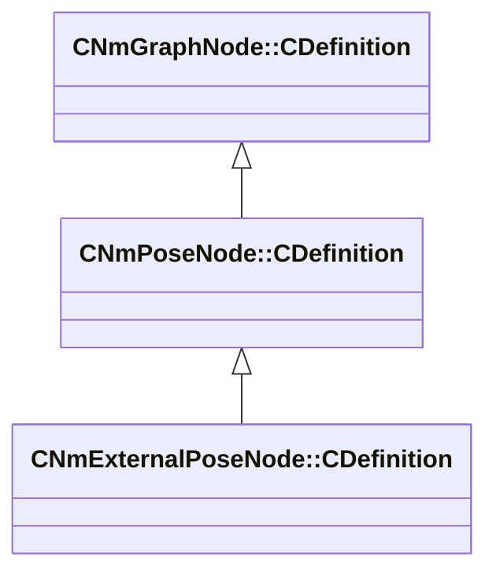

[Schemas](../../schemas.md) / [animlib](../animlib.md) / CNmExternalPoseNode::CDefinition

# CNmExternalPoseNode::CDefinition

> Source: **Build 25000182** · 2026-08-28 · `windows-x86_64` · schema `0.10.0`

**Kind:** class · **Size:** 24 bytes (`0x18`) · **Align:** 8 · **Module:** animlib

**Inherits from:** [CNmPoseNode::CDefinition](../animlib/CNmPoseNode.CDefinition.md)

**Relationships:**

## Memory layout

2 fields (1 declared here, 1 inherited). Offsets are absolute from the object base.

| Offset | Field | Type | From | Annotations |
|--------|-------|------|------|-------------|
| `0x8` | `m_nNodeIdx` | int16 | [CNmGraphNode::CDefinition](../animlib/CNmGraphNode.CDefinition.md) |  |
| `0x10` | `m_bShouldSampleRootMotion` | bool |  |  |

KV3 class defaults

<pre>{
	&quot;_class&quot;: &quot;CNmExternalPoseNode::CDefinition&quot;,
	&quot;m_nNodeIdx&quot;: -1,
	&quot;m_bShouldSampleRootMotion&quot;: false
}</pre>

