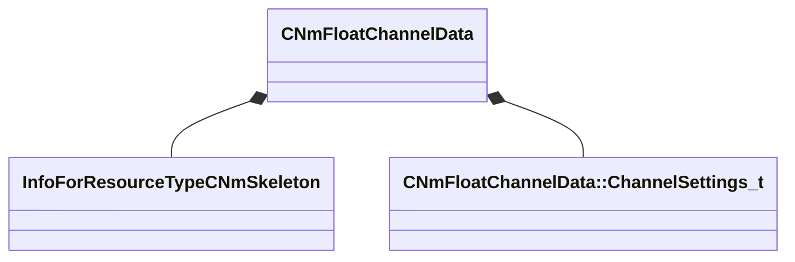

[Schemas](../../schemas.md) / [animlib](../animlib.md) / CNmFloatChannelData

# CNmFloatChannelData

> Source: **Build 25000182** · 2026-08-28 · `windows-x86_64` · schema `0.10.0`

**Kind:** class · **Size:** 88 bytes (`0x58`) · **Align:** 8 · **Module:** animlib

**Relationships:**

## Memory layout

5 fields (5 declared here, 0 inherited). Offsets are absolute from the object base.

| Offset | Field | Type | From | Annotations |
|--------|-------|------|------|-------------|
| `0x0` | `m_skeleton` | CStrongHandle< [InfoForResourceTypeCNmSkeleton](../resourcesystem/InfoForResourceTypeCNmSkeleton.md) > |  |  |
| `0x8` | `m_setID` | CGlobalSymbol |  |  |
| `0x10` | `m_channelSettings` | CUtlVector< [CNmFloatChannelData::ChannelSettings_t](../animlib/CNmFloatChannelData.ChannelSettings_t.md) > |  |  |
| `0x28` | `m_compressedData` | CUtlVector< uint16 > |  |  |
| `0x40` | `m_compressedOffsets` | CUtlVector< uint32 > |  |  |

KV3 class defaults

<pre>{
	&quot;m_skeleton&quot;: &quot;&quot;,
	&quot;m_setID&quot;: &quot;&quot;,
	&quot;m_channelSettings&quot;:
	[
	],
	&quot;m_compressedData&quot;:
	[
	],
	&quot;m_compressedOffsets&quot;:
	[
	]
}</pre>

