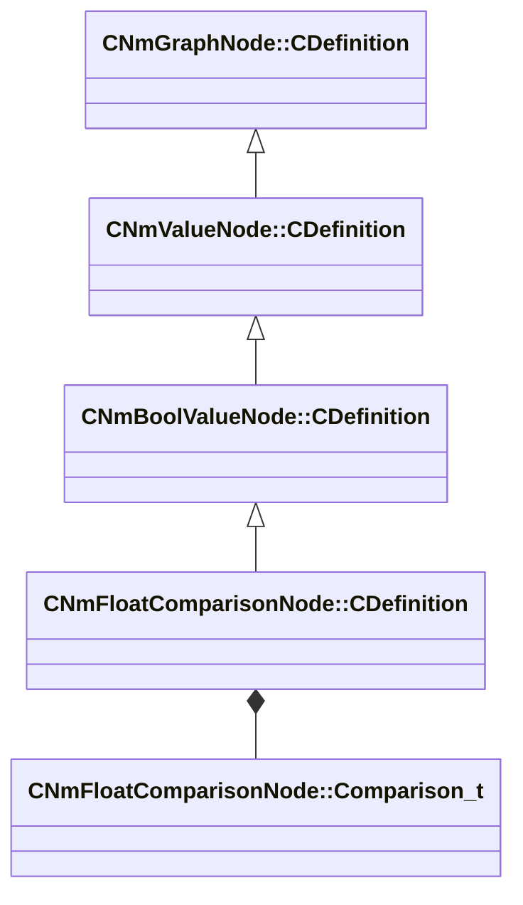

[Schemas](../../schemas.md) / [animlib](../animlib.md) / CNmFloatComparisonNode::CDefinition

# CNmFloatComparisonNode::CDefinition

> Source: **Build 25000182** · 2026-08-28 · `windows-x86_64` · schema `0.10.0`

**Kind:** class · **Size:** 32 bytes (`0x20`) · **Align:** 8 · **Module:** animlib

**Inherits from:** [CNmBoolValueNode::CDefinition](../animlib/CNmBoolValueNode.CDefinition.md)

**Relationships:**

## Memory layout

6 fields (5 declared here, 1 inherited). Offsets are absolute from the object base.

| Offset | Field | Type | From | Annotations |
|--------|-------|------|------|-------------|
| `0x8` | `m_nNodeIdx` | int16 | [CNmGraphNode::CDefinition](../animlib/CNmGraphNode.CDefinition.md) |  |
| `0x10` | `m_nInputValueNodeIdx` | int16 |  |  |
| `0x12` | `m_nComparandValueNodeIdx` | int16 |  |  |
| `0x14` | `m_comparison` | [CNmFloatComparisonNode::Comparison_t](../animlib/CNmFloatComparisonNode.Comparison_t.md) |  |  |
| `0x18` | `m_flEpsilon` | float32 |  |  |
| `0x1c` | `m_flComparisonValue` | float32 |  |  |

KV3 class defaults

<pre>{
	&quot;_class&quot;: &quot;CNmFloatComparisonNode::CDefinition&quot;,
	&quot;m_nNodeIdx&quot;: -1,
	&quot;m_nInputValueNodeIdx&quot;: -1,
	&quot;m_nComparandValueNodeIdx&quot;: -1,
	&quot;m_comparison&quot;: &quot;GreaterThanEqual&quot;,
	&quot;m_flEpsilon&quot;: 0.000000,
	&quot;m_flComparisonValue&quot;: 0.000000
}</pre>

