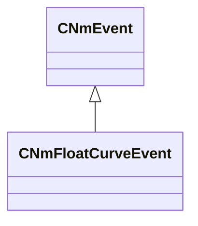

[Schemas](../../schemas.md) / [animlib](../animlib.md) / CNmFloatCurveEvent

# CNmFloatCurveEvent

> Source: **Build 25000182** · 2026-08-28 · `windows-x86_64` · schema `0.10.0`

**Kind:** class · **Size:** 96 bytes (`0x60`) · **Align:** 8 · **Module:** animlib

**Inherits from:** [CNmEvent](../animlib/CNmEvent.md)

**Relationships:**

## Memory layout

5 fields (2 declared here, 3 inherited). Offsets are absolute from the object base.

| Offset | Field | Type | From | Annotations |
|--------|-------|------|------|-------------|
| `0x8` | `m_flStartTime` | [NmPercent_t](../animlib/NmPercent_t.md) | [CNmEvent](../animlib/CNmEvent.md) |  |
| `0xc` | `m_flDuration` | [NmPercent_t](../animlib/NmPercent_t.md) | [CNmEvent](../animlib/CNmEvent.md) |  |
| `0x10` | `m_syncID` | CGlobalSymbol | [CNmEvent](../animlib/CNmEvent.md) |  |
| `0x18` | `m_ID` | CGlobalSymbol |  |  |
| `0x20` | `m_curve` | CPiecewiseCurve |  |  |

KV3 class defaults

<pre>{
	&quot;_class&quot;: &quot;CNmFloatCurveEvent&quot;,
	&quot;m_flStartTime&quot;:
	{
		&quot;m_flValue&quot;: 0.000000
	},
	&quot;m_flDuration&quot;:
	{
		&quot;m_flValue&quot;: 0.000000
	},
	&quot;m_syncID&quot;: &quot;&quot;,
	&quot;m_ID&quot;: &lt;HIDDEN FOR DIFF&gt;,
	&quot;m_curve&quot;:
	{
		&quot;m_spline&quot;:
		[
		],
		&quot;m_tangents&quot;:
		[
		],
		&quot;m_vDomainMins&quot;:
		[
			0.000000,
			0.000000
		],
		&quot;m_vDomainMaxs&quot;:
		[
			0.000000,
			0.000000
		]
	}
}</pre>

