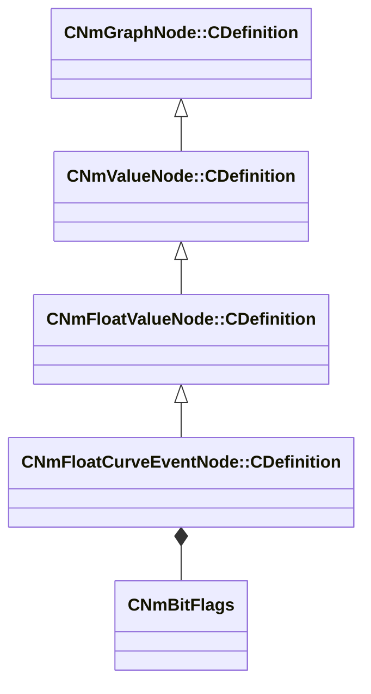

[Schemas](../../schemas.md) / [animlib](../animlib.md) / CNmFloatCurveEventNode::CDefinition

# CNmFloatCurveEventNode::CDefinition

> Source: **Build 25000182** · 2026-08-28 · `windows-x86_64` · schema `0.10.0`

**Kind:** class · **Size:** 40 bytes (`0x28`) · **Align:** 8 · **Module:** animlib

**Inherits from:** [CNmFloatValueNode::CDefinition](../animlib/CNmFloatValueNode.CDefinition.md)

**Relationships:**

## Memory layout

5 fields (4 declared here, 1 inherited). Offsets are absolute from the object base.

| Offset | Field | Type | From | Annotations |
|--------|-------|------|------|-------------|
| `0x8` | `m_nNodeIdx` | int16 | [CNmGraphNode::CDefinition](../animlib/CNmGraphNode.CDefinition.md) |  |
| `0x10` | `m_eventID` | CGlobalSymbol |  |  |
| `0x18` | `m_nDefaultNodeIdx` | int16 |  |  |
| `0x1c` | `m_flDefaultValue` | float32 |  |  |
| `0x20` | `m_eventConditionRules` | [CNmBitFlags](../animlib/CNmBitFlags.md) |  |  |

KV3 class defaults

<pre>{
	&quot;_class&quot;: &quot;CNmFloatCurveEventNode::CDefinition&quot;,
	&quot;m_nNodeIdx&quot;: -1,
	&quot;m_eventID&quot;: &quot;&quot;,
	&quot;m_nDefaultNodeIdx&quot;: -1,
	&quot;m_flDefaultValue&quot;: 0.000000,
	&quot;m_eventConditionRules&quot;:
	{
		&quot;m_flags&quot;: 0
	}
}</pre>

