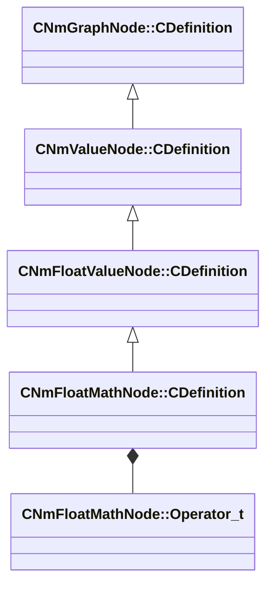

[Schemas](../../schemas.md) / [animlib](../animlib.md) / CNmFloatMathNode::CDefinition

# CNmFloatMathNode::CDefinition

> Source: **Build 25000182** · 2026-08-28 · `windows-x86_64` · schema `0.10.0`

**Kind:** class · **Size:** 32 bytes (`0x20`) · **Align:** 8 · **Module:** animlib

**Inherits from:** [CNmFloatValueNode::CDefinition](../animlib/CNmFloatValueNode.CDefinition.md)

**Relationships:**

## Memory layout

7 fields (6 declared here, 1 inherited). Offsets are absolute from the object base.

| Offset | Field | Type | From | Annotations |
|--------|-------|------|------|-------------|
| `0x8` | `m_nNodeIdx` | int16 | [CNmGraphNode::CDefinition](../animlib/CNmGraphNode.CDefinition.md) |  |
| `0x10` | `m_nInputValueNodeIdxA` | int16 |  |  |
| `0x12` | `m_nInputValueNodeIdxB` | int16 |  |  |
| `0x14` | `m_bReturnAbsoluteResult` | bool |  |  |
| `0x15` | `m_bReturnNegatedResult` | bool |  |  |
| `0x16` | `m_operator` | [CNmFloatMathNode::Operator_t](../animlib/CNmFloatMathNode.Operator_t.md) |  |  |
| `0x18` | `m_flValueB` | float32 |  |  |

KV3 class defaults

<pre>{
	&quot;_class&quot;: &quot;CNmFloatMathNode::CDefinition&quot;,
	&quot;m_nNodeIdx&quot;: -1,
	&quot;m_nInputValueNodeIdxA&quot;: -1,
	&quot;m_nInputValueNodeIdxB&quot;: -1,
	&quot;m_bReturnAbsoluteResult&quot;: false,
	&quot;m_bReturnNegatedResult&quot;: false,
	&quot;m_operator&quot;: &quot;Add&quot;,
	&quot;m_flValueB&quot;: 0.000000
}</pre>

