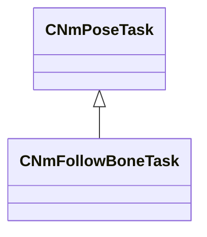

[Schemas](../../schemas.md) / [animlib](../animlib.md) / CNmFollowBoneTask

# CNmFollowBoneTask

**Kind:** class · **Size:** 144 bytes (`0x90`) · **Align:** 16 · **Module:** animlib

**Inherits from:** [CNmPoseTask](../animlib/CNmPoseTask.md)

**Relationships:**

