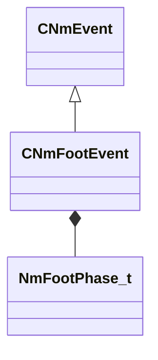

[Schemas](../../schemas.md) / [animlib](../animlib.md) / CNmFootEvent

# CNmFootEvent

> Source: **Build 25000182** · 2026-08-28 · `windows-x86_64` · schema `0.10.0`

**Kind:** class · **Size:** 32 bytes (`0x20`) · **Align:** 8 · **Module:** animlib

**Inherits from:** [CNmEvent](../animlib/CNmEvent.md)

**Relationships:**

## Memory layout

4 fields (1 declared here, 3 inherited). Offsets are absolute from the object base.

| Offset | Field | Type | From | Annotations |
|--------|-------|------|------|-------------|
| `0x8` | `m_flStartTime` | [NmPercent_t](../animlib/NmPercent_t.md) | [CNmEvent](../animlib/CNmEvent.md) |  |
| `0xc` | `m_flDuration` | [NmPercent_t](../animlib/NmPercent_t.md) | [CNmEvent](../animlib/CNmEvent.md) |  |
| `0x10` | `m_syncID` | CGlobalSymbol | [CNmEvent](../animlib/CNmEvent.md) |  |
| `0x18` | `m_phase` | [NmFootPhase_t](../animlib/NmFootPhase_t.md) |  |  |

KV3 class defaults

<pre>{
	&quot;_class&quot;: &quot;CNmFootEvent&quot;,
	&quot;m_flStartTime&quot;:
	{
		&quot;m_flValue&quot;: 0.000000
	},
	&quot;m_flDuration&quot;:
	{
		&quot;m_flValue&quot;: 0.000000
	},
	&quot;m_syncID&quot;: &quot;&quot;,
	&quot;m_phase&quot;: &quot;LeftFootDown&quot;
}</pre>

