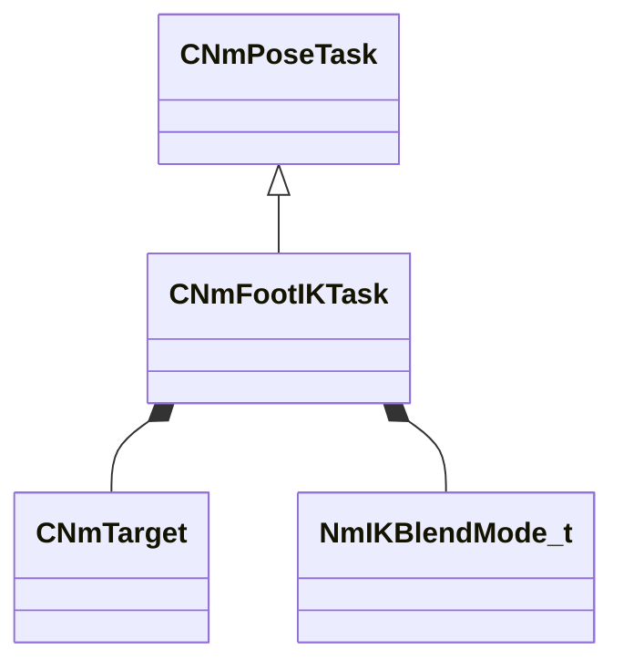

[Schemas](../../schemas.md) / [animlib](../animlib.md) / CNmFootIKTask

# CNmFootIKTask

> Source: **Build 25000182** · 2026-08-28 · `windows-x86_64` · schema `0.10.0`

**Kind:** class · **Size:** 320 bytes (`0x140`) · **Align:** 16 · **Module:** animlib

**Inherits from:** [CNmPoseTask](../animlib/CNmPoseTask.md)

**Relationships:**

## Memory layout

12 fields (12 declared here, 0 inherited). Offsets are absolute from the object base.

| Offset | Field | Type | From | Annotations |
|--------|-------|------|------|-------------|
| `0x70` | `m_nLeftEffectorBoneIdx` | int32 |  |  |
| `0x74` | `m_nRightEffectorBoneIdx` | int32 |  |  |
| `0x80` | `m_leftTargetTransform` | CTransform |  |  |
| `0xa0` | `m_rightTargetTransform` | CTransform |  |  |
| `0xc0` | `m_nLeftTargetBoneIdx` | int32 |  |  |
| `0xc4` | `m_nRightTargetBoneIdx` | int32 |  |  |
| `0xd0` | `m_leftTarget` | [CNmTarget](../animlib/CNmTarget.md) |  |  |
| `0x100` | `m_rightTarget` | [CNmTarget](../animlib/CNmTarget.md) |  |  |
| `0x130` | `m_blendMode` | [NmIKBlendMode_t](../animlib/NmIKBlendMode_t.md) |  |  |
| `0x134` | `m_flBlendWeight` | float32 |  |  |
| `0x138` | `m_bIsTargetInWorldSpace` | bool |  |  |
| `0x139` | `m_bIsRunningFromDeserializedData` | bool |  |  |
