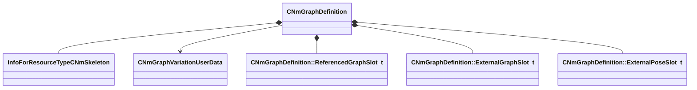

[Schemas](../../schemas.md) / [animlib](../animlib.md) / CNmGraphDefinition

# CNmGraphDefinition

> Source: **Build 25000182** · 2026-08-28 · `windows-x86_64` · schema `0.10.0`

**Kind:** class · **Size:** 440 bytes (`0x1b8`) · **Align:** 8 · **Module:** animlib

**Relationships:**

## Memory layout

14 fields (14 declared here, 0 inherited). Offsets are absolute from the object base.

| Offset | Field | Type | From | Annotations |
|--------|-------|------|------|-------------|
| `0x0` | `m_variationID` | CGlobalSymbol |  |  |
| `0x8` | `m_skeleton` | CStrongHandle< [InfoForResourceTypeCNmSkeleton](../resourcesystem/InfoForResourceTypeCNmSkeleton.md) > |  |  |
| `0x10` | `m_supportedSecondarySkeletons` | CUtlVector< CStrongHandle< [InfoForResourceTypeCNmSkeleton](../resourcesystem/InfoForResourceTypeCNmSkeleton.md) > > |  |  |
| `0x28` | `m_pUserData` | [CNmGraphVariationUserData](../animlib/CNmGraphVariationUserData.md)* |  |  |
| `0x30` | `m_persistentNodeIndices` | CUtlVector< int16 > |  |  |
| `0x48` | `m_nRootNodeIdx` | int16 |  |  |
| `0x50` | `m_controlParameterIDs` | CUtlVector< CGlobalSymbol > |  |  |
| `0x68` | `m_virtualParameterIDs` | CUtlVector< CGlobalSymbol > |  |  |
| `0x80` | `m_virtualParameterNodeIndices` | CUtlVector< int16 > |  |  |
| `0x98` | `m_referencedGraphSlots` | CUtlVector< [CNmGraphDefinition::ReferencedGraphSlot_t](../animlib/CNmGraphDefinition.ReferencedGraphSlot_t.md) > |  |  |
| `0xb0` | `m_externalGraphSlots` | CUtlVector< [CNmGraphDefinition::ExternalGraphSlot_t](../animlib/CNmGraphDefinition.ExternalGraphSlot_t.md) > |  |  |
| `0xc8` | `m_externalPoseSlots` | CUtlVector< [CNmGraphDefinition::ExternalPoseSlot_t](../animlib/CNmGraphDefinition.ExternalPoseSlot_t.md) > |  |  |
| `0x150` | `m_nodePaths` | CUtlVector< CUtlString > |  |  |
| `0x168` | `m_resources` | CUtlVector< CStrongHandleVoid > |  |  |

KV3 class defaults

<pre>{
	&quot;m_variationID&quot;: &quot;&quot;,
	&quot;m_skeleton&quot;: &quot;&quot;,
	&quot;m_supportedSecondarySkeletons&quot;:
	[
	],
	&quot;m_pUserData&quot;: null,
	&quot;m_persistentNodeIndices&quot;:
	[
	],
	&quot;m_nRootNodeIdx&quot;: -1,
	&quot;m_controlParameterIDs&quot;:
	[
	],
	&quot;m_virtualParameterIDs&quot;:
	[
	],
	&quot;m_virtualParameterNodeIndices&quot;:
	[
	],
	&quot;m_referencedGraphSlots&quot;:
	[
	],
	&quot;m_externalGraphSlots&quot;:
	[
	],
	&quot;m_externalPoseSlots&quot;:
	[
	],
	&quot;m_nodePaths&quot;:
	[
	],
	&quot;m_resources&quot;:
	[
	],
	&quot;m_nodes&quot;:
	[
	]
}</pre>

