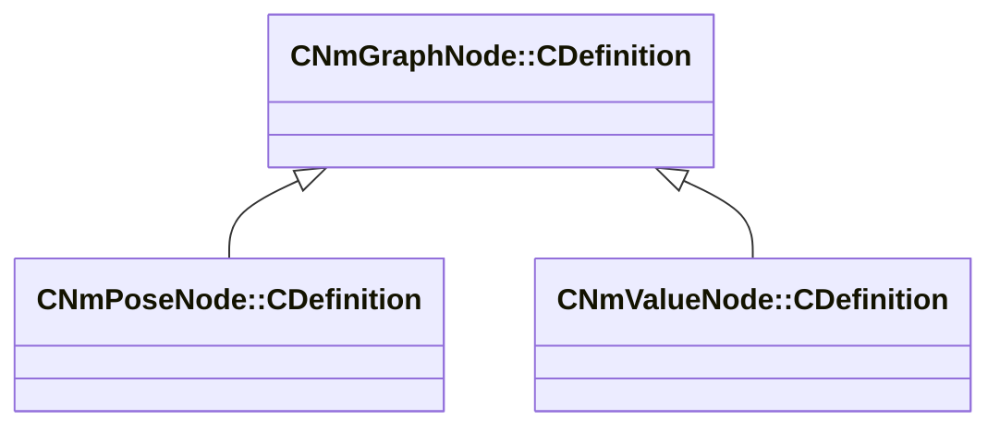

[Schemas](../../schemas.md) / [animlib](../animlib.md) / CNmGraphNode::CDefinition

# CNmGraphNode::CDefinition

> Source: **Build 25000182** · 2026-08-28 · `windows-x86_64` · schema `0.10.0`

**Kind:** class · **Size:** 16 bytes (`0x10`) · **Align:** n/a (unspecified) · **Module:** animlib

**Derived by:** [CNmPoseNode::CDefinition](../animlib/CNmPoseNode.CDefinition.md), [CNmValueNode::CDefinition](../animlib/CNmValueNode.CDefinition.md)

**Relationships:**

## Memory layout

1 field (1 declared here, 0 inherited). Offsets are absolute from the object base.

| Offset | Field | Type | From | Annotations |
|--------|-------|------|------|-------------|
| `0x8` | `m_nNodeIdx` | int16 |  |  |
