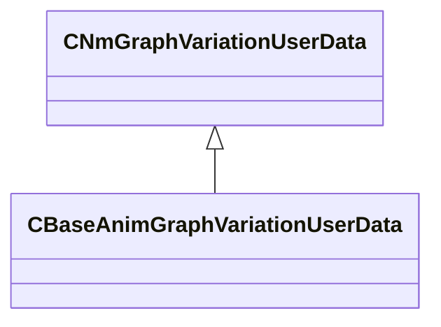

[Schemas](../../schemas.md) / [animlib](../animlib.md) / CNmGraphVariationUserData

# CNmGraphVariationUserData

> Source: **Build 25000182** · 2026-08-28 · `windows-x86_64` · schema `0.10.0`

**Kind:** class · **Size:** 8 bytes (`0x8`) · **Align:** 8 · **Module:** animlib

**Derived by:** [CBaseAnimGraphVariationUserData](../server/CBaseAnimGraphVariationUserData.md)

**Relationships:**

## Memory layout

No schema-visible fields (8 bytes of opaque storage).

KV3 class defaults

<pre>{
	&quot;_class&quot;: &quot;CNmGraphVariationUserData&quot;
}</pre>

