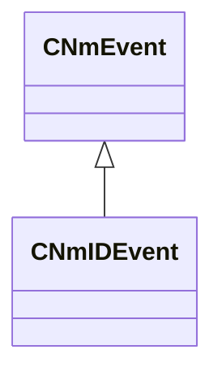

[Schemas](../../schemas.md) / [animlib](../animlib.md) / CNmIDEvent

# CNmIDEvent

**Kind:** class · **Size:** 40 bytes (`0x28`) · **Align:** 8 · **Module:** animlib

**Inherits from:** [CNmEvent](../animlib/CNmEvent.md)

**Relationships:**

## Memory layout

5 fields (2 declared here, 3 inherited). Offsets are absolute from the object base.

| Offset | Field | Type | From | Annotations |
|--------|-------|------|------|-------------|
| `0x8` | `m_flStartTime` | [NmPercent_t](../animlib/NmPercent_t.md) | [CNmEvent](../animlib/CNmEvent.md) |  |
| `0xc` | `m_flDuration` | [NmPercent_t](../animlib/NmPercent_t.md) | [CNmEvent](../animlib/CNmEvent.md) |  |
| `0x10` | `m_syncID` | CGlobalSymbol | [CNmEvent](../animlib/CNmEvent.md) |  |
| `0x18` | `m_ID` | CGlobalSymbol |  |  |
| `0x20` | `m_secondaryID` | CGlobalSymbol |  |  |

KV3 class defaults

<pre>{
	&quot;_class&quot;: &quot;CNmIDEvent&quot;,
	&quot;m_flStartTime&quot;:
	{
		&quot;m_flValue&quot;: 0.000000
	},
	&quot;m_flDuration&quot;:
	{
		&quot;m_flValue&quot;: 0.000000
	},
	&quot;m_syncID&quot;: &quot;&quot;,
	&quot;m_ID&quot;: &lt;HIDDEN FOR DIFF&gt;,
	&quot;m_secondaryID&quot;: &quot;&quot;
}</pre>

