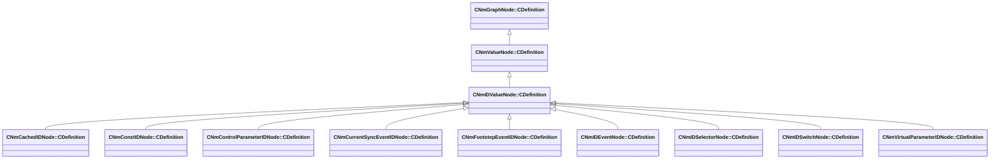

[Schemas](../../schemas.md) / [animlib](../animlib.md) / CNmIDValueNode::CDefinition

# CNmIDValueNode::CDefinition

> Source: **Build 25000182** · 2026-08-28 · `windows-x86_64` · schema `0.10.0`

**Kind:** class · **Size:** 16 bytes (`0x10`) · **Align:** n/a (unspecified) · **Module:** animlib

**Inherits from:** [CNmValueNode::CDefinition](../animlib/CNmValueNode.CDefinition.md)

**Derived by:** [CNmCachedIDNode::CDefinition](../animlib/CNmCachedIDNode.CDefinition.md), [CNmConstIDNode::CDefinition](../animlib/CNmConstIDNode.CDefinition.md), [CNmControlParameterIDNode::CDefinition](../animlib/CNmControlParameterIDNode.CDefinition.md), [CNmCurrentSyncEventIDNode::CDefinition](../animlib/CNmCurrentSyncEventIDNode.CDefinition.md), [CNmFootstepEventIDNode::CDefinition](../animlib/CNmFootstepEventIDNode.CDefinition.md), [CNmIDEventNode::CDefinition](../animlib/CNmIDEventNode.CDefinition.md), [CNmIDSelectorNode::CDefinition](../animlib/CNmIDSelectorNode.CDefinition.md), [CNmIDSwitchNode::CDefinition](../animlib/CNmIDSwitchNode.CDefinition.md), [CNmVirtualParameterIDNode::CDefinition](../animlib/CNmVirtualParameterIDNode.CDefinition.md)

**Relationships:**

## Memory layout

1 field (0 declared here, 1 inherited). Offsets are absolute from the object base.

| Offset | Field | Type | From | Annotations |
|--------|-------|------|------|-------------|
| `0x8` | `m_nNodeIdx` | int16 | [CNmGraphNode::CDefinition](../animlib/CNmGraphNode.CDefinition.md) |  |
