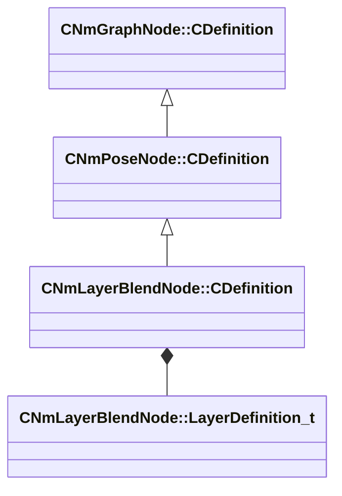

[Schemas](../../schemas.md) / [animlib](../animlib.md) / CNmLayerBlendNode::CDefinition

# CNmLayerBlendNode::CDefinition

> Source: **Build 25000182** · 2026-08-28 · `windows-x86_64` · schema `0.10.0`

**Kind:** class · **Size:** 72 bytes (`0x48`) · **Align:** 8 · **Module:** animlib

**Inherits from:** [CNmPoseNode::CDefinition](../animlib/CNmPoseNode.CDefinition.md)

**Relationships:**

## Memory layout

4 fields (3 declared here, 1 inherited). Offsets are absolute from the object base.

| Offset | Field | Type | From | Annotations |
|--------|-------|------|------|-------------|
| `0x8` | `m_nNodeIdx` | int16 | [CNmGraphNode::CDefinition](../animlib/CNmGraphNode.CDefinition.md) |  |
| `0x10` | `m_nBaseNodeIdx` | int16 |  |  |
| `0x12` | `m_bOnlySampleBaseRootMotion` | bool |  |  |
| `0x18` | `m_layerDefinition` | CUtlLeanVectorFixedGrowable< [CNmLayerBlendNode::LayerDefinition_t](../animlib/CNmLayerBlendNode.LayerDefinition_t.md), 3 > |  |  |

KV3 class defaults

<pre>{
	&quot;_class&quot;: &quot;CNmLayerBlendNode::CDefinition&quot;,
	&quot;m_nNodeIdx&quot;: -1,
	&quot;m_nBaseNodeIdx&quot;: -1,
	&quot;m_bOnlySampleBaseRootMotion&quot;: true,
	&quot;m_layerDefinition&quot;:
	[
	]
}</pre>

