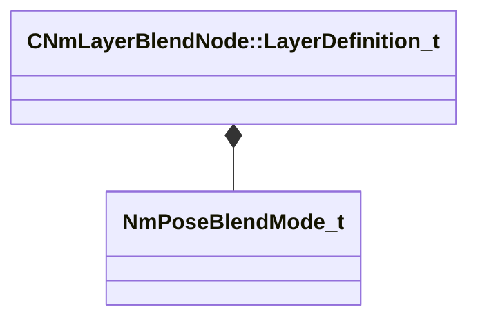

[Schemas](../../schemas.md) / [animlib](../animlib.md) / CNmLayerBlendNode::LayerDefinition_t

# CNmLayerBlendNode::LayerDefinition_t

> Source: **Build 25000182** · 2026-08-28 · `windows-x86_64` · schema `0.10.0`

**Kind:** class · **Size:** 12 bytes (`0xc`) · **Align:** 2 · **Module:** animlib

**Relationships:**

## Memory layout

8 fields (8 declared here, 0 inherited). Offsets are absolute from the object base.

| Offset | Field | Type | From | Annotations |
|--------|-------|------|------|-------------|
| `0x0` | `m_nInputNodeIdx` | int16 |  |  |
| `0x2` | `m_nWeightValueNodeIdx` | int16 |  |  |
| `0x4` | `m_nBoneMaskValueNodeIdx` | int16 |  |  |
| `0x6` | `m_nRootMotionWeightValueNodeIdx` | int16 |  |  |
| `0x8` | `m_bIsSynchronized` | bool |  |  |
| `0x9` | `m_bIgnoreEvents` | bool |  |  |
| `0xa` | `m_bIsStateMachineLayer` | bool |  |  |
| `0xb` | `m_blendMode` | [NmPoseBlendMode_t](../animlib/NmPoseBlendMode_t.md) |  |  |

KV3 class defaults

<pre>{
	&quot;m_nInputNodeIdx&quot;: -1,
	&quot;m_nWeightValueNodeIdx&quot;: -1,
	&quot;m_nBoneMaskValueNodeIdx&quot;: -1,
	&quot;m_nRootMotionWeightValueNodeIdx&quot;: -1,
	&quot;m_bIsSynchronized&quot;: false,
	&quot;m_bIgnoreEvents&quot;: false,
	&quot;m_bIsStateMachineLayer&quot;: false,
	&quot;m_blendMode&quot;: &quot;Overlay&quot;
}</pre>

