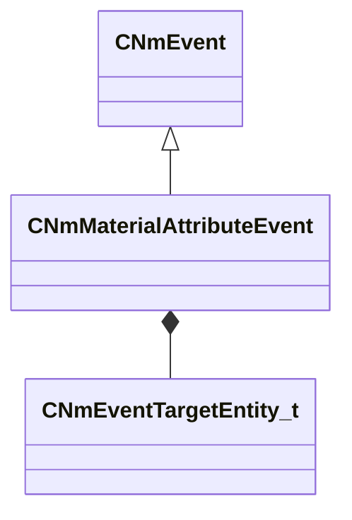

[Schemas](../../schemas.md) / [animlib](../animlib.md) / CNmMaterialAttributeEvent

# CNmMaterialAttributeEvent

**Kind:** class · **Size:** 304 bytes (`0x130`) · **Align:** 8 · **Module:** animlib

**Inherits from:** [CNmEvent](../animlib/CNmEvent.md)

**Relationships:**

## Memory layout

10 fields (7 declared here, 3 inherited). Offsets are absolute from the object base.

| Offset | Field | Type | From | Annotations |
|--------|-------|------|------|-------------|
| `0x8` | `m_flStartTime` | [NmPercent_t](../animlib/NmPercent_t.md) | [CNmEvent](../animlib/CNmEvent.md) |  |
| `0xc` | `m_flDuration` | [NmPercent_t](../animlib/NmPercent_t.md) | [CNmEvent](../animlib/CNmEvent.md) |  |
| `0x10` | `m_syncID` | CGlobalSymbol | [CNmEvent](../animlib/CNmEvent.md) |  |
| `0x18` | `m_target` | [CNmEventTargetEntity_t](../!GlobalTypes/CNmEventTargetEntity_t.md) |  |  |
| `0x20` | `m_attributeName` | CUtlString |  |  |
| `0x28` | `m_attributeNameToken` | CUtlStringToken |  |  |
| `0x30` | `m_x` | CPiecewiseCurve |  |  |
| `0x70` | `m_y` | CPiecewiseCurve |  |  |
| `0xb0` | `m_z` | CPiecewiseCurve |  |  |
| `0xf0` | `m_w` | CPiecewiseCurve |  |  |

KV3 class defaults

<pre>{
	&quot;_class&quot;: &quot;CNmMaterialAttributeEvent&quot;,
	&quot;m_flStartTime&quot;:
	{
		&quot;m_flValue&quot;: 0.000000
	},
	&quot;m_flDuration&quot;:
	{
		&quot;m_flValue&quot;: 0.000000
	},
	&quot;m_syncID&quot;: &quot;&quot;,
	&quot;m_target&quot;: &quot;Self&quot;,
	&quot;m_attributeName&quot;: &quot;&quot;,
	&quot;m_attributeNameToken&quot;: &quot;&quot;,
	&quot;m_x&quot;:
	{
		&quot;m_spline&quot;:
		[
		],
		&quot;m_tangents&quot;:
		[
		],
		&quot;m_vDomainMins&quot;:
		[
			0.000000,
			0.000000
		],
		&quot;m_vDomainMaxs&quot;:
		[
			0.000000,
			0.000000
		]
	},
	&quot;m_y&quot;:
	{
		&quot;m_spline&quot;:
		[
		],
		&quot;m_tangents&quot;:
		[
		],
		&quot;m_vDomainMins&quot;:
		[
			0.000000,
			0.000000
		],
		&quot;m_vDomainMaxs&quot;:
		[
			0.000000,
			0.000000
		]
	},
	&quot;m_z&quot;:
	{
		&quot;m_spline&quot;:
		[
		],
		&quot;m_tangents&quot;:
		[
		],
		&quot;m_vDomainMins&quot;:
		[
			0.000000,
			0.000000
		],
		&quot;m_vDomainMaxs&quot;:
		[
			0.000000,
			0.000000
		]
	},
	&quot;m_w&quot;:
	{
		&quot;m_spline&quot;:
		[
		],
		&quot;m_tangents&quot;:
		[
		],
		&quot;m_vDomainMins&quot;:
		[
			0.000000,
			0.000000
		],
		&quot;m_vDomainMaxs&quot;:
		[
			0.000000,
			0.000000
		]
	}
}</pre>

