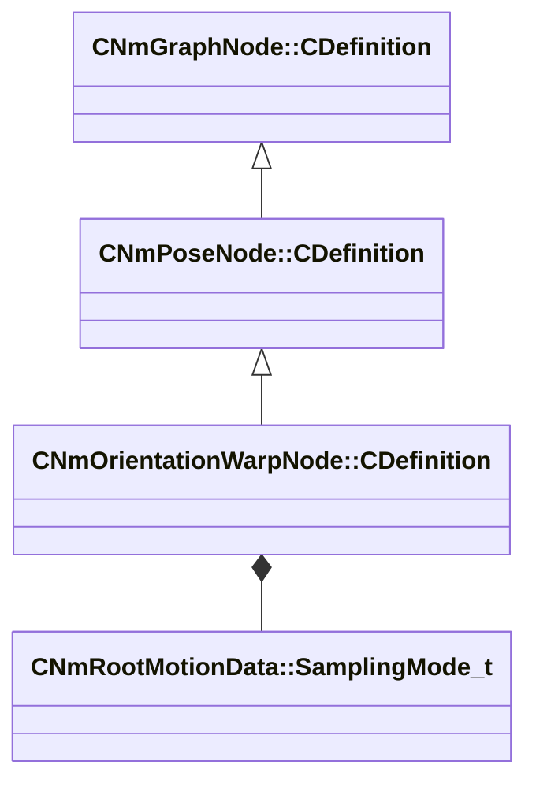

[Schemas](../../schemas.md) / [animlib](../animlib.md) / CNmOrientationWarpNode::CDefinition

# CNmOrientationWarpNode::CDefinition

> Source: **Build 25000182** · 2026-08-28 · `windows-x86_64` · schema `0.10.0`

**Kind:** class · **Size:** 24 bytes (`0x18`) · **Align:** 8 · **Module:** animlib

**Inherits from:** [CNmPoseNode::CDefinition](../animlib/CNmPoseNode.CDefinition.md)

**Relationships:**

## Memory layout

7 fields (6 declared here, 1 inherited). Offsets are absolute from the object base.

| Offset | Field | Type | From | Annotations |
|--------|-------|------|------|-------------|
| `0x8` | `m_nNodeIdx` | int16 | [CNmGraphNode::CDefinition](../animlib/CNmGraphNode.CDefinition.md) |  |
| `0x10` | `m_nClipReferenceNodeIdx` | int16 |  |  |
| `0x12` | `m_nTargetValueNodeIdx` | int16 |  |  |
| `0x14` | `m_bIsOffsetNode` | bool |  |  |
| `0x15` | `m_bIsOffsetRelativeToCharacter` | bool |  |  |
| `0x16` | `m_bWarpTranslation` | bool |  |  |
| `0x17` | `m_samplingMode` | [CNmRootMotionData::SamplingMode_t](../animlib/CNmRootMotionData.SamplingMode_t.md) |  |  |

KV3 class defaults

<pre>{
	&quot;_class&quot;: &quot;CNmOrientationWarpNode::CDefinition&quot;,
	&quot;m_nNodeIdx&quot;: -1,
	&quot;m_nClipReferenceNodeIdx&quot;: -1,
	&quot;m_nTargetValueNodeIdx&quot;: -1,
	&quot;m_bIsOffsetNode&quot;: false,
	&quot;m_bIsOffsetRelativeToCharacter&quot;: true,
	&quot;m_bWarpTranslation&quot;: false,
	&quot;m_samplingMode&quot;: &quot;WorldSpace&quot;
}</pre>

