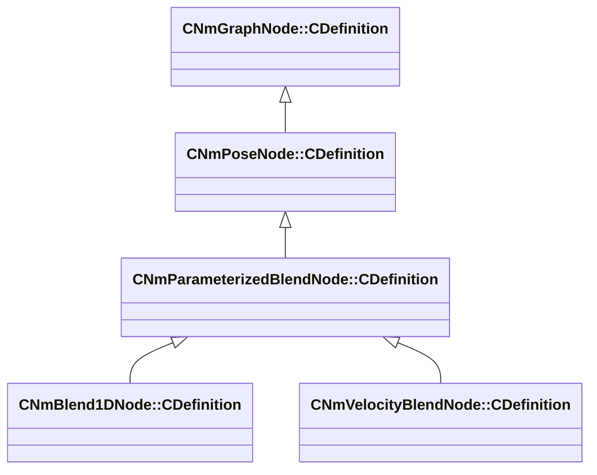

[Schemas](../../schemas.md) / [animlib](../animlib.md) / CNmParameterizedBlendNode::CDefinition

# CNmParameterizedBlendNode::CDefinition

> Source: **Build 25000182** · 2026-08-28 · `windows-x86_64` · schema `0.10.0`

**Kind:** class · **Size:** 48 bytes (`0x30`) · **Align:** 8 · **Module:** animlib

**Inherits from:** [CNmPoseNode::CDefinition](../animlib/CNmPoseNode.CDefinition.md)

**Derived by:** [CNmBlend1DNode::CDefinition](../animlib/CNmBlend1DNode.CDefinition.md), [CNmVelocityBlendNode::CDefinition](../animlib/CNmVelocityBlendNode.CDefinition.md)

**Relationships:**

## Memory layout

4 fields (3 declared here, 1 inherited). Offsets are absolute from the object base.

| Offset | Field | Type | From | Annotations |
|--------|-------|------|------|-------------|
| `0x8` | `m_nNodeIdx` | int16 | [CNmGraphNode::CDefinition](../animlib/CNmGraphNode.CDefinition.md) |  |
| `0x10` | `m_sourceNodeIndices` | CUtlLeanVectorFixedGrowable< int16, 5 > |  |  |
| `0x28` | `m_nInputParameterValueNodeIdx` | int16 |  |  |
| `0x2a` | `m_bAllowLooping` | bool |  |  |

KV3 class defaults

<pre>{
	&quot;_class&quot;: &quot;CNmParameterizedBlendNode::CDefinition&quot;,
	&quot;m_nNodeIdx&quot;: -1,
	&quot;m_sourceNodeIndices&quot;:
	[
	],
	&quot;m_nInputParameterValueNodeIdx&quot;: -1,
	&quot;m_bAllowLooping&quot;: true
}</pre>

