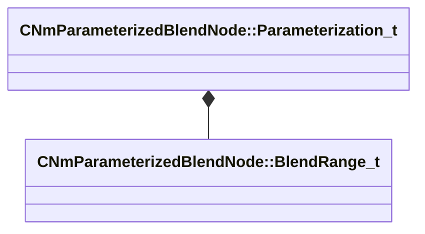

[Schemas](../../schemas.md) / [animlib](../animlib.md) / CNmParameterizedBlendNode::Parameterization_t

# CNmParameterizedBlendNode::Parameterization_t

> Source: **Build 25000182** · 2026-08-28 · `windows-x86_64` · schema `0.10.0`

**Kind:** class · **Size:** 80 bytes (`0x50`) · **Align:** 8 · **Module:** animlib

**Relationships:**

## Memory layout

2 fields (2 declared here, 0 inherited). Offsets are absolute from the object base.

| Offset | Field | Type | From | Annotations |
|--------|-------|------|------|-------------|
| `0x0` | `m_blendRanges` | CUtlLeanVectorFixedGrowable< [CNmParameterizedBlendNode::BlendRange_t](../animlib/CNmParameterizedBlendNode.BlendRange_t.md), 5 > |  |  |
| `0x48` | `m_parameterRange` | Range_t |  |  |

KV3 class defaults

<pre>{
	&quot;m_blendRanges&quot;:
	[
	],
	&quot;m_parameterRange&quot;:
	{
		&quot;m_flMin&quot;: 340282346638528859811704183484516925440.000000,
		&quot;m_flMax&quot;: -340282346638528859811704183484516925440.000000
	}
}</pre>

