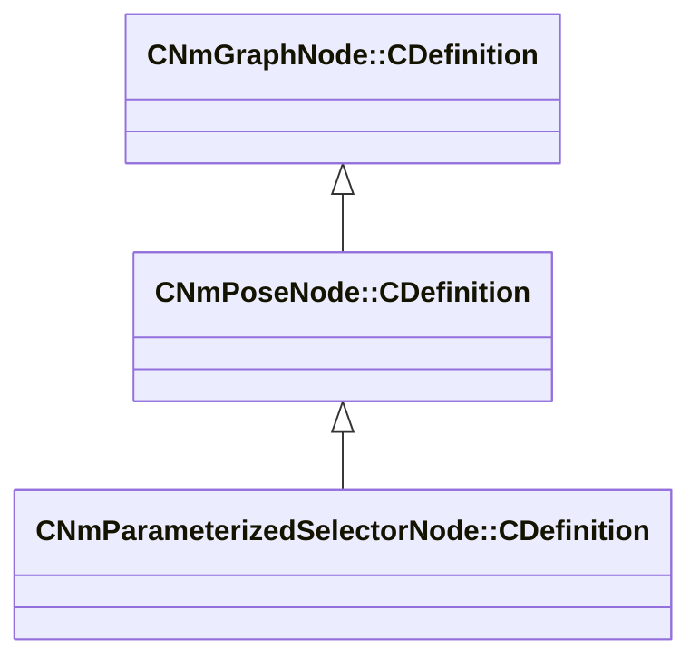

[Schemas](../../schemas.md) / [animlib](../animlib.md) / CNmParameterizedSelectorNode::CDefinition

# CNmParameterizedSelectorNode::CDefinition

> Source: **Build 25000182** · 2026-08-28 · `windows-x86_64` · schema `0.10.0`

**Kind:** class · **Size:** 64 bytes (`0x40`) · **Align:** 8 · **Module:** animlib

**Inherits from:** [CNmPoseNode::CDefinition](../animlib/CNmPoseNode.CDefinition.md)

**Relationships:**

## Memory layout

6 fields (5 declared here, 1 inherited). Offsets are absolute from the object base.

| Offset | Field | Type | From | Annotations |
|--------|-------|------|------|-------------|
| `0x8` | `m_nNodeIdx` | int16 | [CNmGraphNode::CDefinition](../animlib/CNmGraphNode.CDefinition.md) |  |
| `0x10` | `m_optionNodeIndices` | CUtlLeanVectorFixedGrowable< int16, 8 > |  |  |
| `0x28` | `m_optionWeights` | CUtlLeanVectorFixedGrowable< uint8, 8 > |  |  |
| `0x38` | `m_parameterNodeIdx` | int16 |  |  |
| `0x3a` | `m_bIgnoreInvalidOptions` | bool |  |  |
| `0x3b` | `m_bHasWeightsSet` | bool |  |  |

KV3 class defaults

<pre>{
	&quot;_class&quot;: &quot;CNmParameterizedSelectorNode::CDefinition&quot;,
	&quot;m_nNodeIdx&quot;: -1,
	&quot;m_optionNodeIndices&quot;:
	[
	],
	&quot;m_optionWeights&quot;:
	[
	],
	&quot;m_parameterNodeIdx&quot;: -1,
	&quot;m_bIgnoreInvalidOptions&quot;: false,
	&quot;m_bHasWeightsSet&quot;: false
}</pre>

