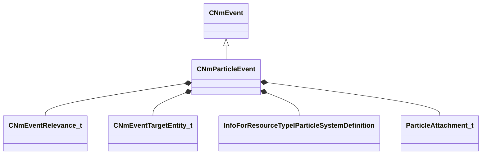

[Schemas](../../schemas.md) / [animlib](../animlib.md) / CNmParticleEvent

# CNmParticleEvent

**Kind:** class · **Size:** 112 bytes (`0x70`) · **Align:** 8 · **Module:** animlib

**Inherits from:** [CNmEvent](../animlib/CNmEvent.md)

**Relationships:**

## Memory layout

17 fields (14 declared here, 3 inherited). Offsets are absolute from the object base.

| Offset | Field | Type | From | Annotations |
|--------|-------|------|------|-------------|
| `0x8` | `m_flStartTime` | [NmPercent_t](../animlib/NmPercent_t.md) | [CNmEvent](../animlib/CNmEvent.md) |  |
| `0xc` | `m_flDuration` | [NmPercent_t](../animlib/NmPercent_t.md) | [CNmEvent](../animlib/CNmEvent.md) |  |
| `0x10` | `m_syncID` | CGlobalSymbol | [CNmEvent](../animlib/CNmEvent.md) |  |
| `0x18` | `m_relevance` | [CNmEventRelevance_t](../!GlobalTypes/CNmEventRelevance_t.md) |  |  |
| `0x1c` | `m_type` | [CNmParticleEvent](../animlib/CNmParticleEvent.md)::Type_t |  |  |
| `0x20` | `m_target` | [CNmEventTargetEntity_t](../!GlobalTypes/CNmEventTargetEntity_t.md) |  |  |
| `0x28` | `m_hParticleSystem` | CStrongHandle< [InfoForResourceTypeIParticleSystemDefinition](../resourcesystem/InfoForResourceTypeIParticleSystemDefinition.md) > |  |  |
| `0x30` | `m_tags` | CUtlString |  |  |
| `0x38` | `m_bStopImmediately` | bool |  |  |
| `0x39` | `m_bDetachFromOwner` | bool |  |  |
| `0x3a` | `m_bPlayEndCap` | bool |  |  |
| `0x40` | `m_attachmentPoint0` | CUtlString |  |  |
| `0x48` | `m_attachmentType0` | [ParticleAttachment_t](../!GlobalTypes/ParticleAttachment_t.md) |  |  |
| `0x50` | `m_attachmentPoint1` | CUtlString |  |  |
| `0x58` | `m_attachmentType1` | [ParticleAttachment_t](../!GlobalTypes/ParticleAttachment_t.md) |  |  |
| `0x60` | `m_config` | CUtlString |  |  |
| `0x68` | `m_effectForConfig` | CUtlString |  |  |

KV3 class defaults

<pre>{
	&quot;_class&quot;: &quot;CNmParticleEvent&quot;,
	&quot;m_flStartTime&quot;:
	{
		&quot;m_flValue&quot;: 0.000000
	},
	&quot;m_flDuration&quot;:
	{
		&quot;m_flValue&quot;: 0.000000
	},
	&quot;m_syncID&quot;: &quot;&quot;,
	&quot;m_relevance&quot;: &quot;ClientAndServer&quot;,
	&quot;m_type&quot;: &quot;Create&quot;,
	&quot;m_target&quot;: &quot;Self&quot;,
	&quot;m_hParticleSystem&quot;: &quot;&quot;,
	&quot;m_tags&quot;: &quot;&quot;,
	&quot;m_bStopImmediately&quot;: false,
	&quot;m_bDetachFromOwner&quot;: false,
	&quot;m_bPlayEndCap&quot;: false,
	&quot;m_attachmentPoint0&quot;: &quot;&quot;,
	&quot;m_attachmentType0&quot;: &quot;PATTACH_ABSORIGIN&quot;,
	&quot;m_attachmentPoint1&quot;: &quot;&quot;,
	&quot;m_attachmentType1&quot;: &quot;PATTACH_ABSORIGIN&quot;,
	&quot;m_config&quot;: &quot;preview&quot;,
	&quot;m_effectForConfig&quot;: &quot;&quot;
}</pre>

