[Schemas](../../schemas.md) / [animlib](../animlib.md) / CNmPoseNode::CDefinition

# CNmPoseNode::CDefinition

> Source: **Build 25000182** · 2026-08-28 · `windows-x86_64` · schema `0.10.0`

**Kind:** class · **Size:** 16 bytes (`0x10`) · **Align:** n/a (unspecified) · **Module:** animlib

**Inherits from:** [CNmGraphNode::CDefinition](../animlib/CNmGraphNode.CDefinition.md)

**Derived by:** [CNmAnimationPoseNode::CDefinition](../animlib/CNmAnimationPoseNode.CDefinition.md), [CNmBlend2DNode::CDefinition](../animlib/CNmBlend2DNode.CDefinition.md), [CNmClipReferenceNode::CDefinition](../animlib/CNmClipReferenceNode.CDefinition.md), [CNmExternalPoseNode::CDefinition](../animlib/CNmExternalPoseNode.CDefinition.md), [CNmIDBasedSelectorNode::CDefinition](../animlib/CNmIDBasedSelectorNode.CDefinition.md), [CNmLayerBlendNode::CDefinition](../animlib/CNmLayerBlendNode.CDefinition.md), [CNmOrientationWarpNode::CDefinition](../animlib/CNmOrientationWarpNode.CDefinition.md), [CNmParameterizedBlendNode::CDefinition](../animlib/CNmParameterizedBlendNode.CDefinition.md), [CNmParameterizedSelectorNode::CDefinition](../animlib/CNmParameterizedSelectorNode.CDefinition.md), [CNmPassthroughNode::CDefinition](../animlib/CNmPassthroughNode.CDefinition.md), [CNmReferencePoseNode::CDefinition](../animlib/CNmReferencePoseNode.CDefinition.md), [CNmReferencedGraphNode::CDefinition](../animlib/CNmReferencedGraphNode.CDefinition.md), [CNmSelectorNode::CDefinition](../animlib/CNmSelectorNode.CDefinition.md), [CNmStateMachineNode::CDefinition](../animlib/CNmStateMachineNode.CDefinition.md), [CNmStateNode::CDefinition](../animlib/CNmStateNode.CDefinition.md), [CNmTargetWarpNode::CDefinition](../animlib/CNmTargetWarpNode.CDefinition.md), [CNmTransitionNode::CDefinition](../animlib/CNmTransitionNode.CDefinition.md), [CNmZeroPoseNode::CDefinition](../animlib/CNmZeroPoseNode.CDefinition.md)

**Relationships:**

```mermaid
classDiagram
    `CNmGraphNode::CDefinition` <|-- `CNmPoseNode::CDefinition`
    `CNmPoseNode::CDefinition` <|-- `CNmAnimationPoseNode::CDefinition`
    `CNmPoseNode::CDefinition` <|-- `CNmBlend2DNode::CDefinition`
    `CNmPoseNode::CDefinition` <|-- `CNmClipReferenceNode::CDefinition`
    `CNmPoseNode::CDefinition` <|-- `CNmExternalPoseNode::CDefinition`
    `CNmPoseNode::CDefinition` <|-- `CNmIDBasedSelectorNode::CDefinition`
    `CNmPoseNode::CDefinition` <|-- `CNmLayerBlendNode::CDefinition`
    `CNmPoseNode::CDefinition` <|-- `CNmOrientationWarpNode::CDefinition`
    `CNmPoseNode::CDefinition` <|-- `CNmParameterizedBlendNode::CDefinition`
    `CNmPoseNode::CDefinition` <|-- `CNmParameterizedSelectorNode::CDefinition`
    `CNmPoseNode::CDefinition` <|-- `CNmPassthroughNode::CDefinition`
    `CNmPoseNode::CDefinition` <|-- `CNmReferencePoseNode::CDefinition`
    `CNmPoseNode::CDefinition` <|-- `CNmReferencedGraphNode::CDefinition`
    `CNmPoseNode::CDefinition` <|-- `CNmSelectorNode::CDefinition`
    `CNmPoseNode::CDefinition` <|-- `CNmStateMachineNode::CDefinition`
    `CNmPoseNode::CDefinition` <|-- `CNmStateNode::CDefinition`
    `CNmPoseNode::CDefinition` <|-- `CNmTargetWarpNode::CDefinition`
    `CNmPoseNode::CDefinition` <|-- `CNmTransitionNode::CDefinition`
    `CNmPoseNode::CDefinition` <|-- `CNmZeroPoseNode::CDefinition`
```

## Memory layout

1 field (0 declared here, 1 inherited). Offsets are absolute from the object base.

| Offset | Field | Type | From | Annotations |
|--------|-------|------|------|-------------|
| `0x8` | `m_nNodeIdx` | int16 | [CNmGraphNode::CDefinition](../animlib/CNmGraphNode.CDefinition.md) |  |
