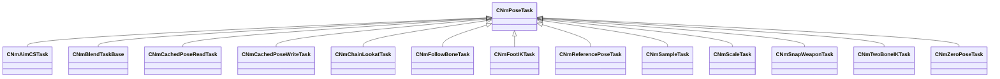

[Schemas](../../schemas.md) / [animlib](../animlib.md) / CNmPoseTask

# CNmPoseTask

**Kind:** class · **Size:** 112 bytes (`0x70`) · **Align:** 255 · **Module:** animlib

**Derived by:** [CNmAimCSTask](../server/CNmAimCSTask.md), [CNmBlendTaskBase](../animlib/CNmBlendTaskBase.md), [CNmCachedPoseReadTask](../animlib/CNmCachedPoseReadTask.md), [CNmCachedPoseWriteTask](../animlib/CNmCachedPoseWriteTask.md), [CNmChainLookatTask](../animlib/CNmChainLookatTask.md), [CNmFollowBoneTask](../animlib/CNmFollowBoneTask.md), [CNmFootIKTask](../animlib/CNmFootIKTask.md), [CNmReferencePoseTask](../animlib/CNmReferencePoseTask.md), [CNmSampleTask](../animlib/CNmSampleTask.md), [CNmScaleTask](../animlib/CNmScaleTask.md), [CNmSnapWeaponTask](../server/CNmSnapWeaponTask.md), [CNmTwoBoneIKTask](../animlib/CNmTwoBoneIKTask.md), [CNmZeroPoseTask](../animlib/CNmZeroPoseTask.md)

**Relationships:**

