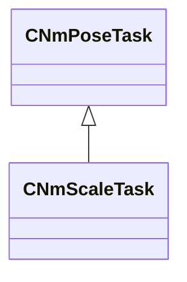

[Schemas](../../schemas.md) / [animlib](../animlib.md) / CNmScaleTask

# CNmScaleTask

> Source: **Build 25000182** · 2026-08-28 · `windows-x86_64` · schema `0.10.0`

**Kind:** class · **Size:** 208 bytes (`0xd0`) · **Align:** 16 · **Module:** animlib

**Inherits from:** [CNmPoseTask](../animlib/CNmPoseTask.md)

**Relationships:**

## Memory layout

No schema-visible fields (208 bytes of opaque storage).
