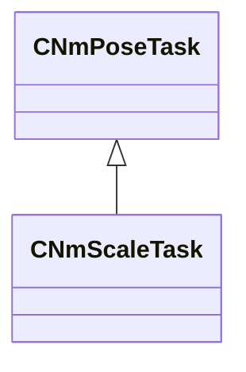

[Schemas](../../schemas.md) / [animlib](../animlib.md) / CNmScaleTask

# CNmScaleTask

**Kind:** class · **Size:** 208 bytes (`0xd0`) · **Align:** 16 · **Module:** animlib

**Inherits from:** [CNmPoseTask](../animlib/CNmPoseTask.md)

**Relationships:**

