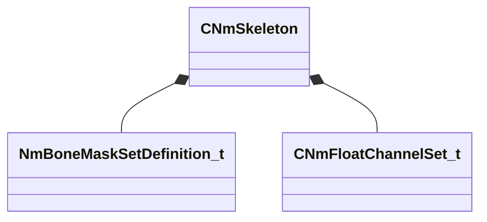

[Schemas](../../schemas.md) / [animlib](../animlib.md) / CNmSkeleton

# CNmSkeleton

**Kind:** class · **Size:** 208 bytes (`0xd0`) · **Align:** 8 · **Module:** animlib

**Relationships:**

## Memory layout

10 fields (10 declared here, 0 inherited). Offsets are absolute from the object base.

| Offset | Field | Type | From | Annotations |
|--------|-------|------|------|-------------|
| `0x0` | `m_ID` | CGlobalSymbol |  |  |
| `0x8` | `m_boneIDs` | CUtlLeanVector< CGlobalSymbol > |  |  |
| `0x18` | `m_parentIndices` | CUtlVector< int32 > |  |  |
| `0x30` | `m_parentSpaceReferencePose` | CUtlVector< CTransform > |  |  |
| `0x48` | `m_modelSpaceReferencePose` | CUtlVector< CTransform > |  |  |
| `0x60` | `m_numBonesToSampleAtLowLOD` | int32 |  |  |
| `0x88` | `m_maskDefinitions` | CUtlLeanVector< [NmBoneMaskSetDefinition_t](../animlib/NmBoneMaskSetDefinition_t.md) > |  |  |
| `0xa8` | `m_secondarySkeletons` | CUtlLeanVector< [CNmSkeleton](../animlib/CNmSkeleton.md)::SecondarySkeleton_t > |  |  |
| `0xb8` | `m_floatChannelSets` | CUtlLeanVector< [CNmFloatChannelSet_t](../animlib/CNmFloatChannelSet_t.md) > |  |  |
| `0xc8` | `m_bIsPropSkeleton` | bool |  |  |

KV3 class defaults

<pre>{
	&quot;m_ID&quot;: &lt;HIDDEN FOR DIFF&gt;,
	&quot;m_boneIDs&quot;:
	[
	],
	&quot;m_parentIndices&quot;:
	[
	],
	&quot;m_parentSpaceReferencePose&quot;:
	[
	],
	&quot;m_modelSpaceReferencePose&quot;:
	[
	],
	&quot;m_numBonesToSampleAtLowLOD&quot;: 0,
	&quot;m_maskDefinitions&quot;:
	[
	],
	&quot;m_secondarySkeletons&quot;:
	[
	],
	&quot;m_floatChannelSets&quot;:
	[
	],
	&quot;m_bIsPropSkeleton&quot;: false
}</pre>

