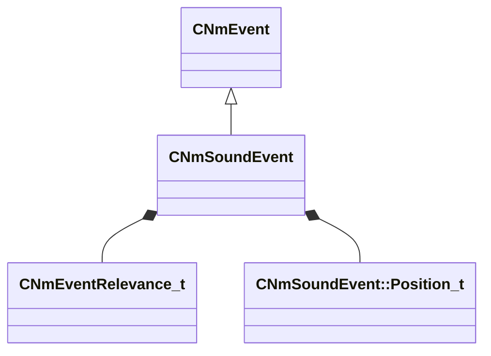

[Schemas](../../schemas.md) / [animlib](../animlib.md) / CNmSoundEvent

# CNmSoundEvent

> Source: **Build 25000182** · 2026-08-28 · `windows-x86_64` · schema `0.10.0`

**Kind:** class · **Size:** 72 bytes (`0x48`) · **Align:** 8 · **Module:** animlib

**Inherits from:** [CNmEvent](../animlib/CNmEvent.md)

**Relationships:**

## Memory layout

10 fields (7 declared here, 3 inherited). Offsets are absolute from the object base.

| Offset | Field | Type | From | Annotations |
|--------|-------|------|------|-------------|
| `0x8` | `m_flStartTime` | [NmPercent_t](../animlib/NmPercent_t.md) | [CNmEvent](../animlib/CNmEvent.md) |  |
| `0xc` | `m_flDuration` | [NmPercent_t](../animlib/NmPercent_t.md) | [CNmEvent](../animlib/CNmEvent.md) |  |
| `0x10` | `m_syncID` | CGlobalSymbol | [CNmEvent](../animlib/CNmEvent.md) |  |
| `0x18` | `m_relevance` | [CNmEventRelevance_t](../animlib/CNmEventRelevance_t.md) |  |  |
| `0x20` | `m_name` | CUtlString |  |  |
| `0x28` | `m_position` | [CNmSoundEvent::Position_t](../animlib/CNmSoundEvent.Position_t.md) |  |  |
| `0x30` | `m_attachmentName` | CUtlString |  |  |
| `0x38` | `m_tags` | CUtlString |  |  |
| `0x40` | `m_bContinuePlayingSoundAtDurationEnd` | bool |  |  |
| `0x44` | `m_flDurationInterruptionThreshold` | float32 |  |  |

KV3 class defaults

<pre>{
	&quot;_class&quot;: &quot;CNmSoundEvent&quot;,
	&quot;m_flStartTime&quot;:
	{
		&quot;m_flValue&quot;: 0.000000
	},
	&quot;m_flDuration&quot;:
	{
		&quot;m_flValue&quot;: 0.000000
	},
	&quot;m_syncID&quot;: &quot;&quot;,
	&quot;m_relevance&quot;: &quot;ClientAndServer&quot;,
	&quot;m_name&quot;: &quot;&quot;,
	&quot;m_position&quot;: &quot;None&quot;,
	&quot;m_attachmentName&quot;: &quot;&quot;,
	&quot;m_tags&quot;: &quot;&quot;,
	&quot;m_bContinuePlayingSoundAtDurationEnd&quot;: false,
	&quot;m_flDurationInterruptionThreshold&quot;: 0.900000
}</pre>

