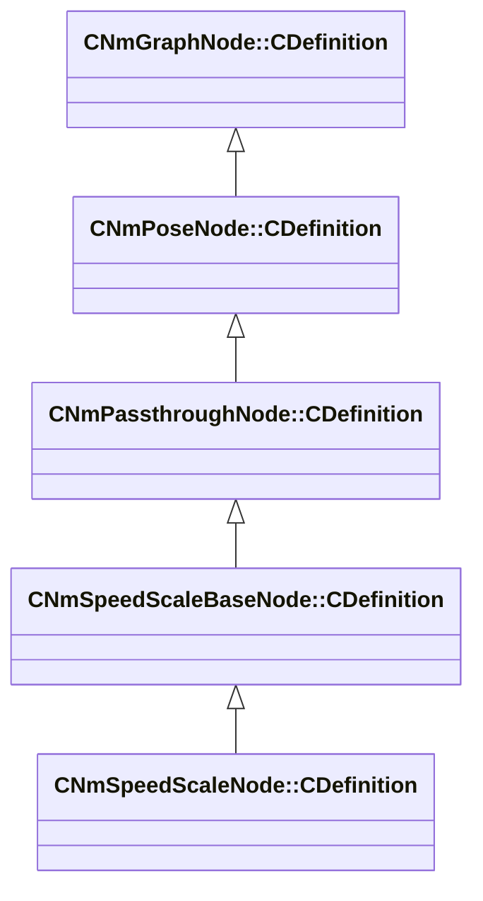

[Schemas](../../schemas.md) / [animlib](../animlib.md) / CNmSpeedScaleNode::CDefinition

# CNmSpeedScaleNode::CDefinition

> Source: **Build 25000182** · 2026-08-28 · `windows-x86_64` · schema `0.10.0`

**Kind:** class · **Size:** 32 bytes (`0x20`) · **Align:** 8 · **Module:** animlib

**Inherits from:** [CNmSpeedScaleBaseNode::CDefinition](../animlib/CNmSpeedScaleBaseNode.CDefinition.md)

**Relationships:**

## Memory layout

4 fields (0 declared here, 4 inherited). Offsets are absolute from the object base.

| Offset | Field | Type | From | Annotations |
|--------|-------|------|------|-------------|
| `0x8` | `m_nNodeIdx` | int16 | [CNmGraphNode::CDefinition](../animlib/CNmGraphNode.CDefinition.md) |  |
| `0x10` | `m_nChildNodeIdx` | int16 | [CNmPassthroughNode::CDefinition](../animlib/CNmPassthroughNode.CDefinition.md) |  |
| `0x18` | `m_nInputValueNodeIdx` | int16 | [CNmSpeedScaleBaseNode::CDefinition](../animlib/CNmSpeedScaleBaseNode.CDefinition.md) |  |
| `0x1c` | `m_flDefaultInputValue` | float32 | [CNmSpeedScaleBaseNode::CDefinition](../animlib/CNmSpeedScaleBaseNode.CDefinition.md) |  |

KV3 class defaults

<pre>{
	&quot;_class&quot;: &quot;CNmSpeedScaleNode::CDefinition&quot;,
	&quot;m_nNodeIdx&quot;: -1,
	&quot;m_nChildNodeIdx&quot;: -1,
	&quot;m_nInputValueNodeIdx&quot;: -1,
	&quot;m_flDefaultInputValue&quot;: 0.000000
}</pre>

