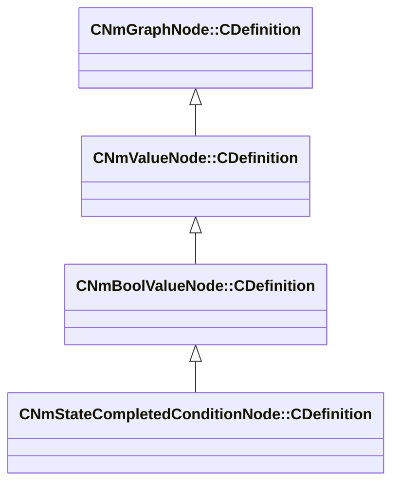

[Schemas](../../schemas.md) / [animlib](../animlib.md) / CNmStateCompletedConditionNode::CDefinition

# CNmStateCompletedConditionNode::CDefinition

> Source: **Build 25000182** · 2026-08-28 · `windows-x86_64` · schema `0.10.0`

**Kind:** class · **Size:** 24 bytes (`0x18`) · **Align:** 8 · **Module:** animlib

**Inherits from:** [CNmBoolValueNode::CDefinition](../animlib/CNmBoolValueNode.CDefinition.md)

**Relationships:**

## Memory layout

4 fields (3 declared here, 1 inherited). Offsets are absolute from the object base.

| Offset | Field | Type | From | Annotations |
|--------|-------|------|------|-------------|
| `0x8` | `m_nNodeIdx` | int16 | [CNmGraphNode::CDefinition](../animlib/CNmGraphNode.CDefinition.md) |  |
| `0x10` | `m_nSourceStateNodeIdx` | int16 |  |  |
| `0x12` | `m_nTransitionDurationOverrideNodeIdx` | int16 |  |  |
| `0x14` | `m_flTransitionDurationSeconds` | float32 |  |  |

KV3 class defaults

<pre>{
	&quot;_class&quot;: &quot;CNmStateCompletedConditionNode::CDefinition&quot;,
	&quot;m_nNodeIdx&quot;: -1,
	&quot;m_nSourceStateNodeIdx&quot;: -1,
	&quot;m_nTransitionDurationOverrideNodeIdx&quot;: -1,
	&quot;m_flTransitionDurationSeconds&quot;: 0.000000
}</pre>

