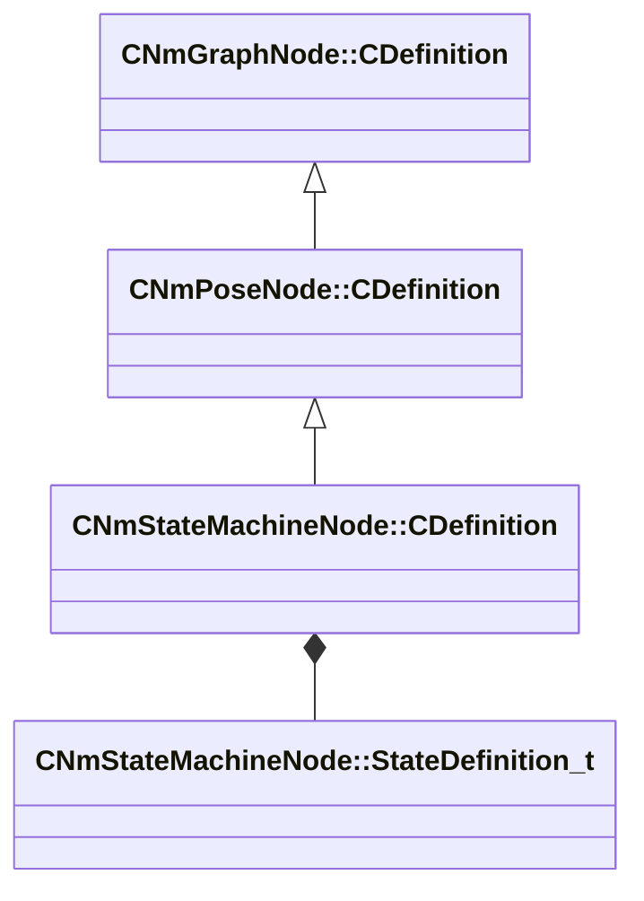

[Schemas](../../schemas.md) / [animlib](../animlib.md) / CNmStateMachineNode::CDefinition

# CNmStateMachineNode::CDefinition

> Source: **Build 25000182** · 2026-08-28 · `windows-x86_64` · schema `0.10.0`

**Kind:** class · **Size:** 312 bytes (`0x138`) · **Align:** 8 · **Module:** animlib

**Inherits from:** [CNmPoseNode::CDefinition](../animlib/CNmPoseNode.CDefinition.md)

**Relationships:**

## Memory layout

3 fields (2 declared here, 1 inherited). Offsets are absolute from the object base.

| Offset | Field | Type | From | Annotations |
|--------|-------|------|------|-------------|
| `0x8` | `m_nNodeIdx` | int16 | [CNmGraphNode::CDefinition](../animlib/CNmGraphNode.CDefinition.md) |  |
| `0x10` | `m_stateDefinitions` | CUtlLeanVectorFixedGrowable< [CNmStateMachineNode::StateDefinition_t](../animlib/CNmStateMachineNode.StateDefinition_t.md), 5 > |  |  |
| `0x130` | `m_nDefaultStateIndex` | int16 |  |  |

KV3 class defaults

<pre>{
	&quot;_class&quot;: &quot;CNmStateMachineNode::CDefinition&quot;,
	&quot;m_nNodeIdx&quot;: -1,
	&quot;m_stateDefinitions&quot;:
	[
	],
	&quot;m_nDefaultStateIndex&quot;: -1
}</pre>

