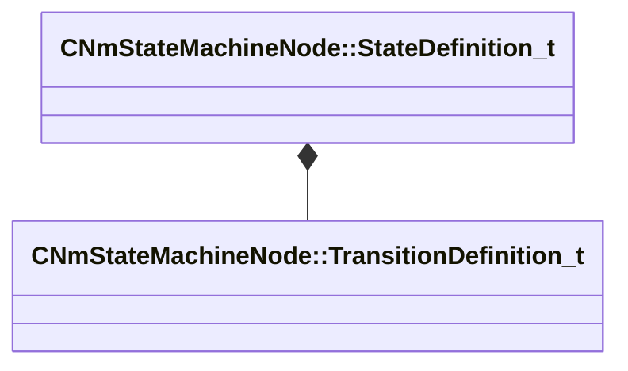

[Schemas](../../schemas.md) / [animlib](../animlib.md) / CNmStateMachineNode::StateDefinition_t

# CNmStateMachineNode::StateDefinition_t

> Source: **Build 25000182** · 2026-08-28 · `windows-x86_64` · schema `0.10.0`

**Kind:** class · **Size:** 56 bytes (`0x38`) · **Align:** 8 · **Module:** animlib

**Relationships:**

## Memory layout

3 fields (3 declared here, 0 inherited). Offsets are absolute from the object base.

| Offset | Field | Type | From | Annotations |
|--------|-------|------|------|-------------|
| `0x0` | `m_nStateNodeIdx` | int16 |  |  |
| `0x2` | `m_nEntryConditionNodeIdx` | int16 |  |  |
| `0x8` | `m_transitionDefinitions` | CUtlLeanVectorFixedGrowable< [CNmStateMachineNode::TransitionDefinition_t](../animlib/CNmStateMachineNode.TransitionDefinition_t.md), 5 > |  |  |

KV3 class defaults

<pre>{
	&quot;m_nStateNodeIdx&quot;: -1,
	&quot;m_nEntryConditionNodeIdx&quot;: -1,
	&quot;m_transitionDefinitions&quot;:
	[
	]
}</pre>

