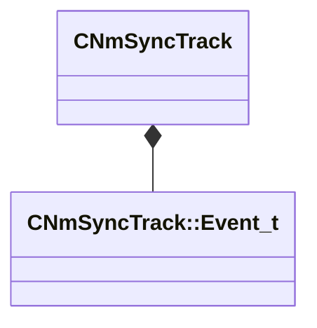

[Schemas](../../schemas.md) / [animlib](../animlib.md) / CNmSyncTrack

# CNmSyncTrack

> Source: **Build 25000182** · 2026-08-28 · `windows-x86_64` · schema `0.10.0`

**Kind:** class · **Size:** 176 bytes (`0xb0`) · **Align:** 8 · **Module:** animlib

**Relationships:**

## Memory layout

2 fields (2 declared here, 0 inherited). Offsets are absolute from the object base.

| Offset | Field | Type | From | Annotations |
|--------|-------|------|------|-------------|
| `0x0` | `m_syncEvents` | CUtlLeanVectorFixedGrowable< [CNmSyncTrack::Event_t](../animlib/CNmSyncTrack.Event_t.md), 10 > |  |  |
| `0xa8` | `m_nStartEventOffset` | int32 |  |  |

KV3 class defaults

<pre>{
	&quot;m_syncEvents&quot;:
	[
		{
			&quot;m_ID&quot;: &lt;HIDDEN FOR DIFF&gt;,
			&quot;m_startTime&quot;:
			{
				&quot;m_flValue&quot;: 0.000000
			},
			&quot;m_duration&quot;:
			{
				&quot;m_flValue&quot;: 1.000000
			}
		}
	],
	&quot;m_nStartEventOffset&quot;: 0
}</pre>

