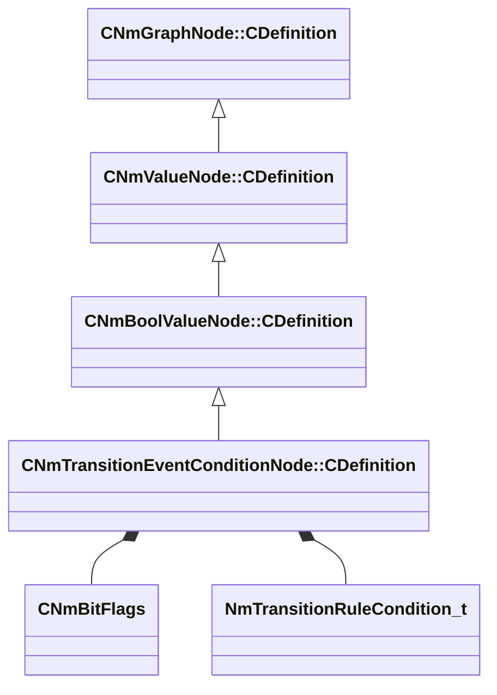

[Schemas](../../schemas.md) / [animlib](../animlib.md) / CNmTransitionEventConditionNode::CDefinition

# CNmTransitionEventConditionNode::CDefinition

> Source: **Build 25000182** · 2026-08-28 · `windows-x86_64` · schema `0.10.0`

**Kind:** class · **Size:** 32 bytes (`0x20`) · **Align:** 8 · **Module:** animlib

**Inherits from:** [CNmBoolValueNode::CDefinition](../animlib/CNmBoolValueNode.CDefinition.md)

**Relationships:**

## Memory layout

5 fields (4 declared here, 1 inherited). Offsets are absolute from the object base.

| Offset | Field | Type | From | Annotations |
|--------|-------|------|------|-------------|
| `0x8` | `m_nNodeIdx` | int16 | [CNmGraphNode::CDefinition](../animlib/CNmGraphNode.CDefinition.md) |  |
| `0x10` | `m_requireRuleID` | CGlobalSymbol |  |  |
| `0x18` | `m_eventConditionRules` | [CNmBitFlags](../animlib/CNmBitFlags.md) |  |  |
| `0x1c` | `m_nSourceStateNodeIdx` | int16 |  |  |
| `0x1e` | `m_ruleCondition` | [NmTransitionRuleCondition_t](../animlib/NmTransitionRuleCondition_t.md) |  |  |

KV3 class defaults

<pre>{
	&quot;_class&quot;: &quot;CNmTransitionEventConditionNode::CDefinition&quot;,
	&quot;m_nNodeIdx&quot;: -1,
	&quot;m_requireRuleID&quot;: &quot;&quot;,
	&quot;m_eventConditionRules&quot;:
	{
		&quot;m_flags&quot;: 0
	},
	&quot;m_nSourceStateNodeIdx&quot;: -1,
	&quot;m_ruleCondition&quot;: &quot;AnyAllowed&quot;
}</pre>

