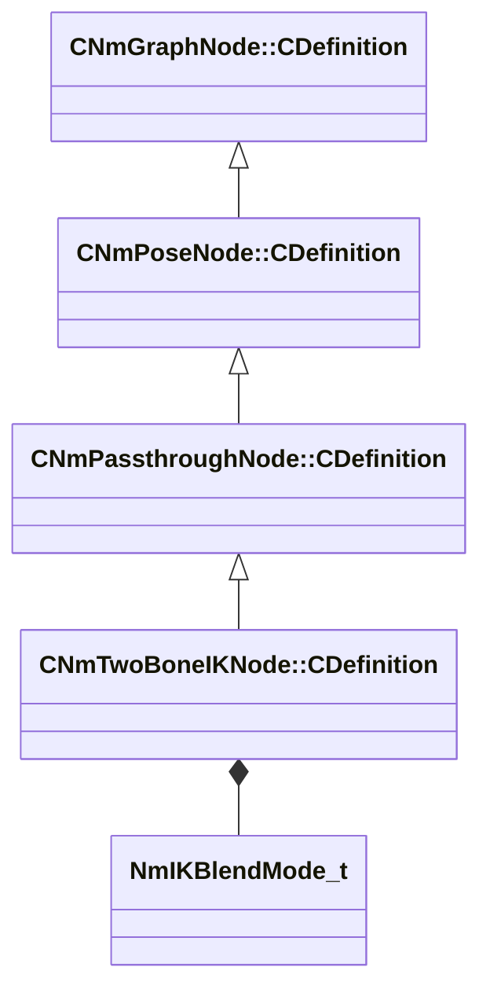

[Schemas](../../schemas.md) / [animlib](../animlib.md) / CNmTwoBoneIKNode::CDefinition

# CNmTwoBoneIKNode::CDefinition

> Source: **Build 25000182** · 2026-08-28 · `windows-x86_64` · schema `0.10.0`

**Kind:** class · **Size:** 48 bytes (`0x30`) · **Align:** 8 · **Module:** animlib

**Inherits from:** [CNmPassthroughNode::CDefinition](../animlib/CNmPassthroughNode.CDefinition.md)

**Relationships:**

## Memory layout

9 fields (7 declared here, 2 inherited). Offsets are absolute from the object base.

| Offset | Field | Type | From | Annotations |
|--------|-------|------|------|-------------|
| `0x8` | `m_nNodeIdx` | int16 | [CNmGraphNode::CDefinition](../animlib/CNmGraphNode.CDefinition.md) |  |
| `0x10` | `m_nChildNodeIdx` | int16 | [CNmPassthroughNode::CDefinition](../animlib/CNmPassthroughNode.CDefinition.md) |  |
| `0x18` | `m_effectorBoneID` | CGlobalSymbol |  |  |
| `0x20` | `m_nEffectorTargetNodeIdx` | int16 |  |  |
| `0x22` | `m_nEnabledNodeIdx` | int16 |  |  |
| `0x24` | `m_flBlendTimeSeconds` | float32 |  |  |
| `0x28` | `m_blendMode` | [NmIKBlendMode_t](../animlib/NmIKBlendMode_t.md) |  |  |
| `0x29` | `m_bIsTargetInWorldSpace` | bool |  |  |
| `0x2c` | `m_flChainRotationWeight` | float32 |  |  |

KV3 class defaults

<pre>{
	&quot;_class&quot;: &quot;CNmTwoBoneIKNode::CDefinition&quot;,
	&quot;m_nNodeIdx&quot;: -1,
	&quot;m_nChildNodeIdx&quot;: -1,
	&quot;m_effectorBoneID&quot;: &quot;&quot;,
	&quot;m_nEffectorTargetNodeIdx&quot;: -1,
	&quot;m_nEnabledNodeIdx&quot;: -1,
	&quot;m_flBlendTimeSeconds&quot;: 0.000000,
	&quot;m_blendMode&quot;: &quot;Effector&quot;,
	&quot;m_bIsTargetInWorldSpace&quot;: false,
	&quot;m_flChainRotationWeight&quot;: 0.000000
}</pre>

