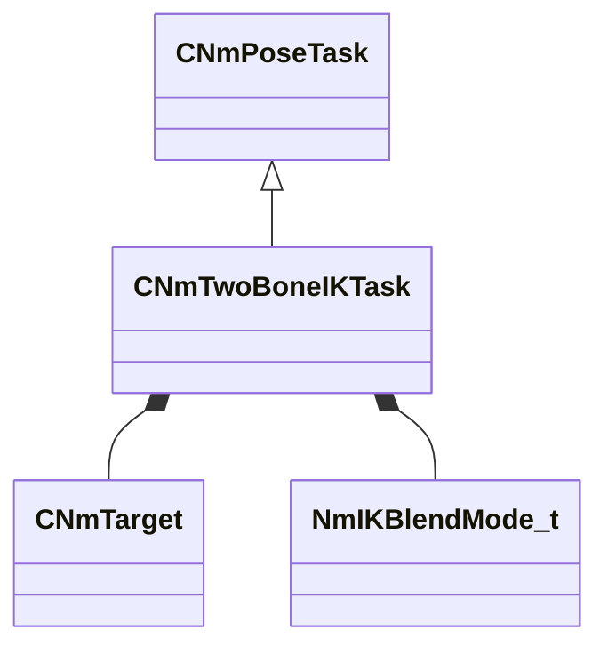

[Schemas](../../schemas.md) / [animlib](../animlib.md) / CNmTwoBoneIKTask

# CNmTwoBoneIKTask

**Kind:** class · **Size:** 240 bytes (`0xf0`) · **Align:** 16 · **Module:** animlib

**Inherits from:** [CNmPoseTask](../animlib/CNmPoseTask.md)

**Relationships:**

## Memory layout

10 fields (10 declared here, 0 inherited). Offsets are absolute from the object base.

| Offset | Field | Type | From | Annotations |
|--------|-------|------|------|-------------|
| `0x70` | `m_nEffectorBoneIdx` | int32 |  |  |
| `0x74` | `m_nEffectorTargetBoneIdx` | int32 |  |  |
| `0x80` | `m_targetTransform` | CTransform |  |  |
| `0xa0` | `m_effectorTarget` | [CNmTarget](../animlib/CNmTarget.md) |  |  |
| `0xd0` | `m_blendMode` | [NmIKBlendMode_t](../animlib/NmIKBlendMode_t.md) |  |  |
| `0xd4` | `m_flBlendWeight` | float32 |  |  |
| `0xd8` | `m_bIsTargetInWorldSpace` | bool |  |  |
| `0xd9` | `m_bIsRunningFromDeserializedData` | bool |  |  |
| `0xdc` | `m_flChainRotationWeight` | float32 |  |  |
| `0xe0` | `m_debugEffectorBoneID` | CGlobalSymbol |  |  |
