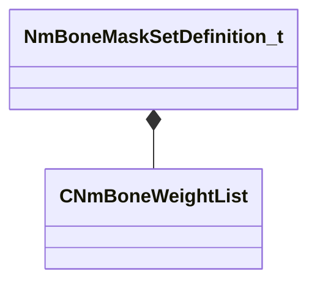

[Schemas](../../schemas.md) / [animlib](../animlib.md) / NmBoneMaskSetDefinition_t

# NmBoneMaskSetDefinition_t

**Kind:** class · **Size:** 296 bytes (`0x128`) · **Align:** 8 · **Module:** animlib

**Relationships:**

## Memory layout

3 fields (3 declared here, 0 inherited). Offsets are absolute from the object base.

| Offset | Field | Type | From | Annotations |
|--------|-------|------|------|-------------|
| `0x0` | `m_ID` | CGlobalSymbol |  |  |
| `0x8` | `m_primaryWeightList` | [CNmBoneWeightList](../animlib/CNmBoneWeightList.md) |  |  |
| `0x118` | `m_secondaryWeightLists` | CUtlLeanVector< [CNmBoneWeightList](../animlib/CNmBoneWeightList.md) > |  |  |

KV3 class defaults

<pre>{
	&quot;m_ID&quot;: &lt;HIDDEN FOR DIFF&gt;,
	&quot;m_primaryWeightList&quot;:
	{
		&quot;m_skeletonName&quot;: &quot;&quot;,
		&quot;m_boneIDs&quot;:
		[
		],
		&quot;m_weights&quot;:
		[
		]
	},
	&quot;m_secondaryWeightLists&quot;:
	[
	]
}</pre>

