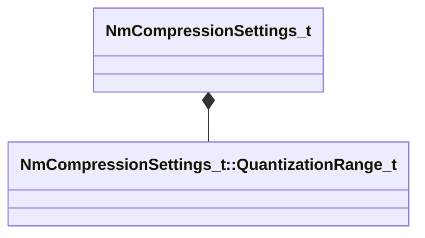

[Schemas](../../schemas.md) / [animlib](../animlib.md) / NmCompressionSettings_t

# NmCompressionSettings_t

> Source: **Build 25000182** · 2026-08-28 · `windows-x86_64` · schema `0.10.0`

**Kind:** class · **Size:** 80 bytes (`0x50`) · **Align:** 16 · **Module:** animlib

**Relationships:**

## Memory layout

9 fields (9 declared here, 0 inherited). Offsets are absolute from the object base.

| Offset | Field | Type | From | Annotations |
|--------|-------|------|------|-------------|
| `0x0` | `m_translationRangeX` | [NmCompressionSettings_t::QuantizationRange_t](../animlib/NmCompressionSettings_t.QuantizationRange_t.md) |  |  |
| `0x8` | `m_translationRangeY` | [NmCompressionSettings_t::QuantizationRange_t](../animlib/NmCompressionSettings_t.QuantizationRange_t.md) |  |  |
| `0x10` | `m_translationRangeZ` | [NmCompressionSettings_t::QuantizationRange_t](../animlib/NmCompressionSettings_t.QuantizationRange_t.md) |  |  |
| `0x18` | `m_scaleRange` | [NmCompressionSettings_t::QuantizationRange_t](../animlib/NmCompressionSettings_t.QuantizationRange_t.md) |  |  |
| `0x20` | `m_nTrackReadOffset` | int32 |  |  |
| `0x30` | `m_constantRotation` | Quaternion |  |  |
| `0x40` | `m_bIsRotationStatic` | bool |  |  |
| `0x41` | `m_bIsTranslationStatic` | bool |  |  |
| `0x42` | `m_bIsScaleStatic` | bool |  |  |

KV3 class defaults

<pre>{
	&quot;m_translationRangeX&quot;:
	{
		&quot;m_flRangeStart&quot;: 0.000000,
		&quot;m_flRangeLength&quot;: -1.000000
	},
	&quot;m_translationRangeY&quot;:
	{
		&quot;m_flRangeStart&quot;: 0.000000,
		&quot;m_flRangeLength&quot;: -1.000000
	},
	&quot;m_translationRangeZ&quot;:
	{
		&quot;m_flRangeStart&quot;: 0.000000,
		&quot;m_flRangeLength&quot;: -1.000000
	},
	&quot;m_scaleRange&quot;:
	{
		&quot;m_flRangeStart&quot;: 0.000000,
		&quot;m_flRangeLength&quot;: -1.000000
	},
	&quot;m_nTrackReadOffset&quot;: 0,
	&quot;m_constantRotation&quot;:
	[
		0.000000,
		0.000000,
		0.000000,
		0.000000
	],
	&quot;m_bIsRotationStatic&quot;: false,
	&quot;m_bIsTranslationStatic&quot;: false,
	&quot;m_bIsScaleStatic&quot;: false
}</pre>

