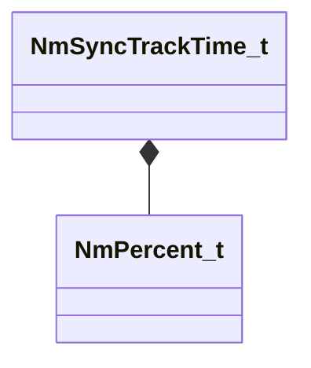

[Schemas](../../schemas.md) / [animlib](../animlib.md) / NmSyncTrackTime_t

# NmSyncTrackTime_t

> Source: **Build 25000182** · 2026-08-28 · `windows-x86_64` · schema `0.10.0`

**Kind:** class · **Size:** 8 bytes (`0x8`) · **Align:** 4 · **Module:** animlib

**Relationships:**

## Memory layout

2 fields (2 declared here, 0 inherited). Offsets are absolute from the object base.

| Offset | Field | Type | From | Annotations |
|--------|-------|------|------|-------------|
| `0x0` | `m_nEventIdx` | int32 |  |  |
| `0x4` | `m_percentageThrough` | [NmPercent_t](../animlib/NmPercent_t.md) |  |  |

KV3 class defaults

<pre>{
	&quot;m_nEventIdx&quot;: 0,
	&quot;m_percentageThrough&quot;:
	{
		&quot;m_flValue&quot;: 0.000000
	}
}</pre>

