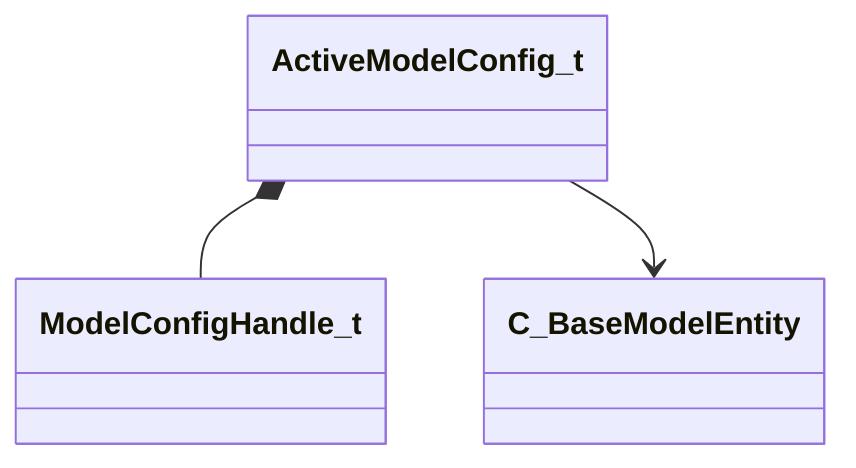

[Schemas](../../schemas.md) / [client](../client.md) / ActiveModelConfig_t

# ActiveModelConfig_t

**Kind:** class · **Size:** 112 bytes (`0x70`) · **Align:** 8 · **Module:** client

**Relationships:**

## Memory layout

4 fields (4 declared here, 0 inherited). Offsets are absolute from the object base.

| Offset | Field | Type | From | Annotations |
|--------|-------|------|------|-------------|
| `0x30` | `m_Handle` | [ModelConfigHandle_t](../server/ModelConfigHandle_t.md) |  |  |
| `0x38` | `m_Name` | CUtlSymbolLarge |  |  |
| `0x40` | `m_AssociatedEntities` | C_NetworkUtlVectorBase< CHandle< [C_BaseModelEntity](../client/C_BaseModelEntity.md) > > |  |  |
| `0x58` | `m_AssociatedEntityNames` | C_NetworkUtlVectorBase< CUtlSymbolLarge > |  |  |

KV3 class defaults

<pre>{
	&quot;_class&quot;: &quot;ActiveModelConfig_t&quot;,
	&quot;m_Handle&quot;: 0,
	&quot;m_Name&quot;: &quot;&quot;,
	&quot;m_AssociatedEntities&quot;:
	[
	],
	&quot;m_AssociatedEntityNames&quot;:
	[
	]
}</pre>

