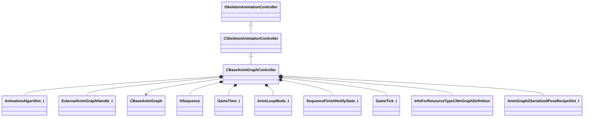

[Schemas](../../schemas.md) / [client](../client.md) / CBaseAnimGraphController

# CBaseAnimGraphController

**Kind:** class · **Size:** 1696 bytes (`0x6a0`) · **Align:** 8 · **Module:** client

**Inherits from:** [CSkeletonAnimationController](../server/CSkeletonAnimationController.md)

**Relationships:**

## Memory layout

33 fields (32 declared here, 1 inherited). Offsets are absolute from the object base.

| Offset | Field | Type | From | Annotations |
|--------|-------|------|------|-------------|
| `0x8` | `m_pSkeletonInstance` | [CSkeletonInstance](../client/CSkeletonInstance.md)* | [CSkeletonAnimationController](../server/CSkeletonAnimationController.md) | `MNotSaved` |
| `0x18` | `m_nAnimationAlgorithm` | [AnimationAlgorithm_t](../server/AnimationAlgorithm_t.md) |  |  |
| `0x1c` | `m_nNextExternalGraphHandle` | [ExternalAnimGraphHandle_t](../server/ExternalAnimGraphHandle_t.md) |  |  |
| `0x20` | `m_vecSecondarySkeletonSlotIDs` | C_NetworkUtlVectorBase< CGlobalSymbol > |  |  |
| `0x38` | `m_vecSecondarySkeletons` | C_NetworkUtlVectorBase< CHandle< [CBaseAnimGraph](../client/CBaseAnimGraph.md) > > |  |  |
| `0x50` | `m_nSecondarySkeletonMasterCount` | int32 |  |  |
| `0x58` | `m_flSoundSyncTime` | float32 |  |  |
| `0x5c` | `m_nActiveIKChainMask` | uint32 |  |  |
| `0xb0` | `m_hSequence` | [HSequence](../animationsystem/HSequence.md) |  |  |
| `0xb4` | `m_flSeqStartTime` | [GameTime_t](../entity2/GameTime_t.md) |  |  |
| `0xb8` | `m_flSeqFixedCycle` | float32 |  |  |
| `0xbc` | `m_nAnimLoopMode` | [AnimLoopMode_t](../server/AnimLoopMode_t.md) |  |  |
| `0xc0` | `m_flPlaybackRate` | CNetworkedQuantizedFloat |  |  |
| `0xcc` | `m_nNotifyState` | [SequenceFinishNotifyState_t](../server/SequenceFinishNotifyState_t.md) |  |  |
| `0xcd` | `m_bNetworkedAnimationInputsChanged` | bool |  |  |
| `0xce` | `m_bNetworkedSequenceChanged` | bool |  |  |
| `0xcf` | `m_bLastUpdateSkipped` | bool |  |  |
| `0xd0` | `m_bSequenceFinished` | bool |  |  |
| `0xd4` | `m_nPrevAnimUpdateTick` | [GameTick_t](../entity2/GameTick_t.md) |  |  |
| `0x370` | `m_hGraphDefinitionAG2` | CStrongHandle< [InfoForResourceTypeCNmGraphDefinition](../resourcesystem/InfoForResourceTypeCNmGraphDefinition.md) > |  |  |
| `0x378` | `m_SerializePoseRecipeAG2Slots` | C_UtlVectorEmbeddedNetworkVar< [AnimGraph2SerializedPoseRecipeSlot_t](../client/AnimGraph2SerializedPoseRecipeSlot_t.md) > |  | `MNotSaved` |
| `0x3e0` | `m_SerializePoseRecipeAG2Dynamic` | C_NetworkUtlVectorBase< uint8 > |  | `MNotSaved` |
| `0x3f8` | `m_nSerializePoseRecipeAG2ActiveSlot` | uint32 |  | `MNotSaved` |
| `0x3fc` | `m_nSerializePoseRecipeVersionAG2` | int32 |  | `MNotSaved` |
| `0x400` | `m_nServerGraphInstanceIteration` | int32 |  |  |
| `0x404` | `m_nServerSerializationContextIteration` | int32 |  |  |
| `0x408` | `m_primaryGraphId` | [ResourceId_t](../resourcefile/ResourceId_t.md) |  |  |
| `0x410` | `m_vecExternalGraphIds` | C_NetworkUtlVectorBase< [ResourceId_t](../resourcefile/ResourceId_t.md) > |  |  |
| `0x428` | `m_vecExternalClipIds` | C_NetworkUtlVectorBase< [ResourceId_t](../resourcefile/ResourceId_t.md) > |  |  |
| `0x440` | `m_sAnimGraph2Identifier` | CGlobalSymbol |  |  |
| `0x448` | `m_pGraphInstanceAG2` | [CAnimGraph2InstancePtr](../server/CAnimGraph2InstancePtr.md) |  |  |
| `0x668` | `m_vecExternalGraphs` | [CExternalAnimGraphList](../server/CExternalAnimGraphList.md) |  |  |
| `0x699` | `m_nPrevAnimationAlgorithm` | [AnimationAlgorithm_t](../server/AnimationAlgorithm_t.md) |  |  |

KV3 class defaults

<pre>{
	&quot;m_nAnimationAlgorithm&quot;: &quot;eInvalid&quot;,
	&quot;m_nNextExternalGraphHandle&quot;: 0,
	&quot;m_vecSecondarySkeletonSlotIDs&quot;:
	[
	],
	&quot;m_vecSecondarySkeletons&quot;:
	[
	],
	&quot;m_nSecondarySkeletonMasterCount&quot;: 0,
	&quot;m_flSoundSyncTime&quot;: 0.000000,
	&quot;m_nActiveIKChainMask&quot;: 0,
	&quot;m_hSequence&quot;: -1,
	&quot;m_flSeqStartTime&quot;: null,
	&quot;m_flSeqFixedCycle&quot;: 0.000000,
	&quot;m_nAnimLoopMode&quot;: &quot;ANIM_LOOP_MODE_USE_SEQUENCE_SETTINGS&quot;,
	&quot;m_flPlaybackRate&quot;: 1.000000,
	&quot;m_nNotifyState&quot;: &quot;eDoNotNotify&quot;,
	&quot;m_bNetworkedAnimationInputsChanged&quot;: false,
	&quot;m_bNetworkedSequenceChanged&quot;: false,
	&quot;m_bLastUpdateSkipped&quot;: false,
	&quot;m_bSequenceFinished&quot;: false,
	&quot;m_nPrevAnimUpdateTick&quot;: null,
	&quot;m_hGraphDefinitionAG2&quot;: &quot;&quot;,
	&quot;m_nServerGraphInstanceIteration&quot;: 0,
	&quot;m_nServerSerializationContextIteration&quot;: 0,
	&quot;m_primaryGraphId&quot;: 0,
	&quot;m_vecExternalGraphIds&quot;:
	[
	],
	&quot;m_vecExternalClipIds&quot;:
	[
	],
	&quot;m_sAnimGraph2Identifier&quot;: &quot;&quot;,
	&quot;m_pGraphInstanceAG2&quot;: null,
	&quot;m_vecExternalGraphs&quot;: null,
	&quot;m_nPrevAnimationAlgorithm&quot;: &quot;eNone&quot;
}</pre>

