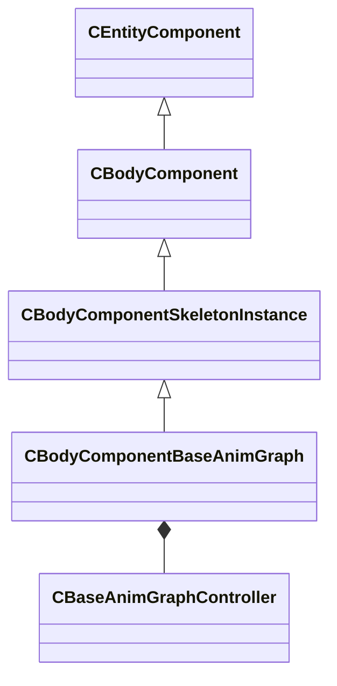

[Schemas](../../schemas.md) / [client](../client.md) / CBodyComponentBaseAnimGraph

# CBodyComponentBaseAnimGraph

**Kind:** class · **Size:** 2992 bytes (`0xbb0`) · **Align:** 255 · **Module:** client

**Inherits from:** [CBodyComponentSkeletonInstance](../client/CBodyComponentSkeletonInstance.md)

**Relationships:**

## Memory layout

4 fields (1 declared here, 3 inherited). Offsets are absolute from the object base.

| Offset | Field | Type | From | Annotations |
|--------|-------|------|------|-------------|
| `0x8` | `m_pSceneNode` | [CGameSceneNode](../client/CGameSceneNode.md)* | [CBodyComponent](../client/CBodyComponent.md) | `MNotSaved` |
| `0x48` | `__m_pChainEntity` | [CNetworkVarChainer](../entity2/CNetworkVarChainer.md) | [CBodyComponent](../client/CBodyComponent.md) | `MNotSaved` |
| `0x80` | `m_skeletonInstance` | [CSkeletonInstance](../client/CSkeletonInstance.md) | [CBodyComponentSkeletonInstance](../client/CBodyComponentSkeletonInstance.md) |  |
| `0x510` | `m_animationController` | [CBaseAnimGraphController](../client/CBaseAnimGraphController.md) |  |  |

KV3 class defaults

<pre>{
	&quot;_class&quot;: &quot;CBodyComponentBaseAnimGraph&quot;,
	&quot;m_skeletonInstance&quot;:
	{
		&quot;m_hParent&quot;:
		{
			&quot;m_hOwner&quot;: null,
			&quot;m_name&quot;: &quot;&quot;
		},
		&quot;m_vecOrigin&quot;:
		[
			0.000000,
			0.000000,
			0.000000
		],
		&quot;m_angRotation&quot;:
		[
			0.000000,
			0.000000,
			0.000000
		],
		&quot;m_flScale&quot;: 1.000000,
		&quot;m_vecAbsOrigin&quot;: null,
		&quot;m_angAbsRotation&quot;:
		[
			0.000000,
			0.000000,
			0.000000
		],
		&quot;m_flAbsScale&quot;: 1.000000,
		&quot;m_bDormant&quot;: false,
		&quot;m_bForceParentToBeNetworked&quot;: false,
		&quot;m_name&quot;: &quot;&quot;,
		&quot;m_hierarchyAttachName&quot;: &quot;&quot;,
		&quot;m_flClientLocalScale&quot;: 1.000000,
		&quot;m_modelState&quot;:
		{
			&quot;m_hModel&quot;: &quot;&quot;,
			&quot;m_ModelName&quot;: &quot;&quot;,
			&quot;m_flRootBoneOffset_x&quot;: 0.000000,
			&quot;m_flRootBoneOffset_y&quot;: 0.000000,
			&quot;m_flRootBoneOffset_z&quot;: 0.000000,
			&quot;m_nRootBoneOffsetResetSerialNumber&quot;: 0,
			&quot;m_bClientClothCreationSuppressed&quot;: false,
			&quot;m_nAnimStateNoInterpSerialNumber&quot;: 0,
			&quot;m_MeshGroupMask&quot;: 9223372036854775808,
			&quot;m_nBodyGroupChoices&quot;:
			[
			],
			&quot;m_nIdealMotionType&quot;: 3,
			&quot;m_nForceLOD&quot;: -1,
			&quot;m_nClothUpdateFlags&quot;: 0
		},
		&quot;m_bDisableSolidCollisionsForHierarchy&quot;: false,
		&quot;m_materialGroup&quot;: &quot;&quot;,
		&quot;m_nHitboxSet&quot;: 0
	},
	&quot;m_animationController&quot;:
	{
		&quot;m_nAnimationAlgorithm&quot;: &quot;eInvalid&quot;,
		&quot;m_nNextExternalGraphHandle&quot;: 0,
		&quot;m_vecSecondarySkeletonSlotIDs&quot;:
		[
		],
		&quot;m_vecSecondarySkeletons&quot;:
		[
		],
		&quot;m_nSecondarySkeletonMasterCount&quot;: 0,
		&quot;m_flSoundSyncTime&quot;: 0.000000,
		&quot;m_nActiveIKChainMask&quot;: 0,
		&quot;m_hSequence&quot;: -1,
		&quot;m_flSeqStartTime&quot;: null,
		&quot;m_flSeqFixedCycle&quot;: 0.000000,
		&quot;m_nAnimLoopMode&quot;: &quot;ANIM_LOOP_MODE_USE_SEQUENCE_SETTINGS&quot;,
		&quot;m_flPlaybackRate&quot;: 1.000000,
		&quot;m_nNotifyState&quot;: &quot;eDoNotNotify&quot;,
		&quot;m_bNetworkedAnimationInputsChanged&quot;: false,
		&quot;m_bNetworkedSequenceChanged&quot;: false,
		&quot;m_bLastUpdateSkipped&quot;: false,
		&quot;m_bSequenceFinished&quot;: false,
		&quot;m_nPrevAnimUpdateTick&quot;: null,
		&quot;m_hGraphDefinitionAG2&quot;: &quot;&quot;,
		&quot;m_nServerGraphInstanceIteration&quot;: 0,
		&quot;m_nServerSerializationContextIteration&quot;: 0,
		&quot;m_primaryGraphId&quot;: 0,
		&quot;m_vecExternalGraphIds&quot;:
		[
		],
		&quot;m_vecExternalClipIds&quot;:
		[
		],
		&quot;m_sAnimGraph2Identifier&quot;: &quot;&quot;,
		&quot;m_pGraphInstanceAG2&quot;: null,
		&quot;m_vecExternalGraphs&quot;: null,
		&quot;m_nPrevAnimationAlgorithm&quot;: &quot;eNone&quot;
	}
}</pre>

