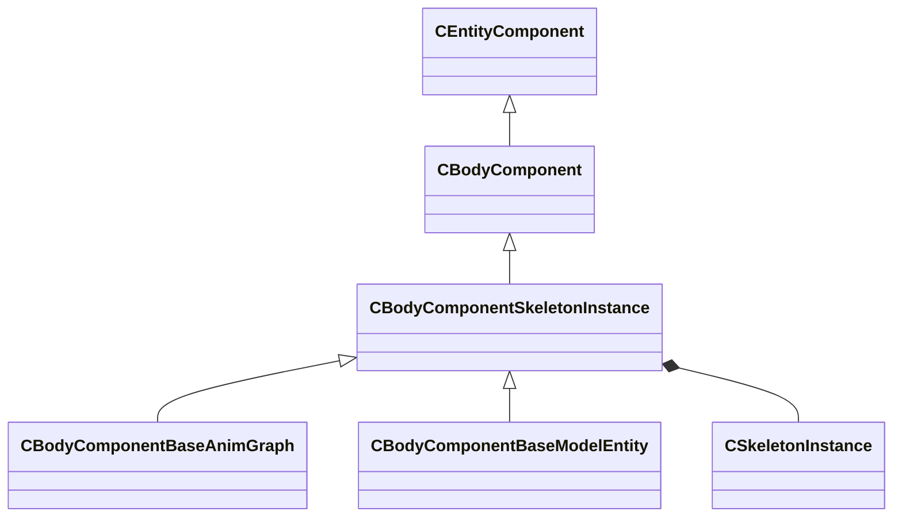

[Schemas](../../schemas.md) / [client](../client.md) / CBodyComponentSkeletonInstance

# CBodyComponentSkeletonInstance

> Source: **Build 25000182** · 2026-08-28 · `windows-x86_64` · schema `0.10.0`

**Kind:** class · **Size:** 1296 bytes (`0x510`) · **Align:** n/a (unspecified) · **Module:** client

**Twin:** [CBodyComponentSkeletonInstance (server)](../server/CBodyComponentSkeletonInstance.md)

**Inherits from:** [CBodyComponent](../client/CBodyComponent.md)

**Derived by:** [CBodyComponentBaseAnimGraph](../client/CBodyComponentBaseAnimGraph.md), [CBodyComponentBaseModelEntity](../client/CBodyComponentBaseModelEntity.md)

**Relationships:**

## Memory layout

3 fields (1 declared here, 2 inherited). Offsets are absolute from the object base.

| Offset | Field | Type | From | Annotations |
|--------|-------|------|------|-------------|
| `0x8` | `m_pSceneNode` | [CGameSceneNode](../client/CGameSceneNode.md)* | [CBodyComponent](../client/CBodyComponent.md) | `MNotSaved` |
| `0x48` | `__m_pChainEntity` | [CNetworkVarChainer](../entity2/CNetworkVarChainer.md) | [CBodyComponent](../client/CBodyComponent.md) | `MNotSaved` |
| `0x80` | `m_skeletonInstance` | [CSkeletonInstance](../client/CSkeletonInstance.md) |  |  |
