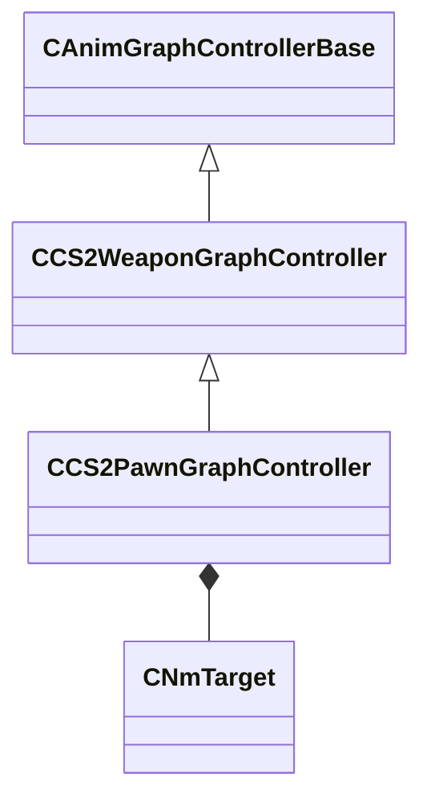

[Schemas](../../schemas.md) / [client](../client.md) / CCS2PawnGraphController

# CCS2PawnGraphController

> Source: **Build 25000182** · 2026-08-28 · `windows-x86_64` · schema `0.10.0`

**Kind:** class · **Size:** 1344 bytes (`0x540`) · **Align:** 8 · **Module:** client

**Twin:** [CCS2PawnGraphController (server)](../server/CCS2PawnGraphController.md)

**Inherits from:** [CCS2WeaponGraphController](../client/CCS2WeaponGraphController.md)

**Relationships:**

## Memory layout

49 fields (28 declared here, 21 inherited). Offsets are absolute from the object base.

| Offset | Field | Type | From | Annotations |
|--------|-------|------|------|-------------|
| `0x10` | `m_hExternalGraph` | [ExternalAnimGraphHandle_t](../server/ExternalAnimGraphHandle_t.md) | [CAnimGraphControllerBase](../server/CAnimGraphControllerBase.md) |  |
| `0x88` | `m_action` | CAnimGraph2ParamOptionalRef< CGlobalSymbol > | [CCS2WeaponGraphController](../client/CCS2WeaponGraphController.md) |  |
| `0xa0` | `m_bActionReset` | CAnimGraph2ParamOptionalRef< bool > | [CCS2WeaponGraphController](../client/CCS2WeaponGraphController.md) |  |
| `0xb8` | `m_flWeaponActionSpeedScale` | CAnimGraph2ParamOptionalRef< float32 > | [CCS2WeaponGraphController](../client/CCS2WeaponGraphController.md) |  |
| `0xd0` | `m_weaponCategory` | CAnimGraph2ParamOptionalRef< CGlobalSymbol > | [CCS2WeaponGraphController](../client/CCS2WeaponGraphController.md) |  |
| `0xe8` | `m_weaponType` | CAnimGraph2ParamOptionalRef< CGlobalSymbol > | [CCS2WeaponGraphController](../client/CCS2WeaponGraphController.md) |  |
| `0x100` | `m_weaponExtraInfo` | CAnimGraph2ParamOptionalRef< CGlobalSymbol > | [CCS2WeaponGraphController](../client/CCS2WeaponGraphController.md) |  |
| `0x118` | `m_flWeaponAmmo` | CAnimGraph2ParamOptionalRef< float32 > | [CCS2WeaponGraphController](../client/CCS2WeaponGraphController.md) |  |
| `0x130` | `m_flWeaponAmmoMax` | CAnimGraph2ParamOptionalRef< float32 > | [CCS2WeaponGraphController](../client/CCS2WeaponGraphController.md) |  |
| `0x148` | `m_flWeaponAmmoReserve` | CAnimGraph2ParamOptionalRef< float32 > | [CCS2WeaponGraphController](../client/CCS2WeaponGraphController.md) |  |
| `0x160` | `m_bWeaponIsSilenced` | CAnimGraph2ParamOptionalRef< bool > | [CCS2WeaponGraphController](../client/CCS2WeaponGraphController.md) |  |
| `0x178` | `m_flWeaponIronsightAmount` | CAnimGraph2ParamOptionalRef< float32 > | [CCS2WeaponGraphController](../client/CCS2WeaponGraphController.md) |  |
| `0x190` | `m_bIsUsingLegacyModel` | CAnimGraph2ParamOptionalRef< bool > | [CCS2WeaponGraphController](../client/CCS2WeaponGraphController.md) |  |
| `0x1a8` | `m_idleVariation` | CAnimGraph2ParamOptionalRef< float32 > | [CCS2WeaponGraphController](../client/CCS2WeaponGraphController.md) |  |
| `0x1c0` | `m_deployVariation` | CAnimGraph2ParamOptionalRef< float32 > | [CCS2WeaponGraphController](../client/CCS2WeaponGraphController.md) |  |
| `0x1d8` | `m_attackType` | CAnimGraph2ParamOptionalRef< CGlobalSymbol > | [CCS2WeaponGraphController](../client/CCS2WeaponGraphController.md) |  |
| `0x1f0` | `m_attackThrowStrength` | CAnimGraph2ParamOptionalRef< float32 > | [CCS2WeaponGraphController](../client/CCS2WeaponGraphController.md) |  |
| `0x208` | `m_flAttackVariation` | CAnimGraph2ParamOptionalRef< float32 > | [CCS2WeaponGraphController](../client/CCS2WeaponGraphController.md) |  |
| `0x220` | `m_inspectVariation` | CAnimGraph2ParamOptionalRef< float32 > | [CCS2WeaponGraphController](../client/CCS2WeaponGraphController.md) |  |
| `0x238` | `m_inspectExtraInfo` | CAnimGraph2ParamOptionalRef< CGlobalSymbol > | [CCS2WeaponGraphController](../client/CCS2WeaponGraphController.md) |  |
| `0x250` | `m_reloadStage` | CAnimGraph2ParamOptionalRef< CGlobalSymbol > | [CCS2WeaponGraphController](../client/CCS2WeaponGraphController.md) |  |
| `0x2a0` | `m_bIsDefusing` | CAnimGraph2ParamOptionalRef< bool > |  |  |
| `0x2b8` | `m_moveType` | CAnimGraph2ParamOptionalRef< CGlobalSymbol > |  |  |
| `0x2d0` | `m_moveDirectionID` | CAnimGraph2ParamOptionalRef< CGlobalSymbol > |  |  |
| `0x2e8` | `m_flMoveSpeedX` | CAnimGraph2ParamOptionalRef< float32 > |  |  |
| `0x300` | `m_flMoveSpeedY` | CAnimGraph2ParamOptionalRef< float32 > |  |  |
| `0x318` | `m_flMoveSpeedHorizontal` | CAnimGraph2ParamOptionalRef< float32 > |  |  |
| `0x330` | `m_flPreviousMoveSpeedHorizontal` | CAnimGraph2ParamOptionalRef< float32 > |  |  |
| `0x348` | `m_flCrouchAmount` | CAnimGraph2ParamOptionalRef< float32 > |  |  |
| `0x360` | `m_bIsWalking` | CAnimGraph2ParamOptionalRef< bool > |  |  |
| `0x378` | `m_flWeaponDropAmount` | CAnimGraph2ParamOptionalRef< float32 > |  |  |
| `0x390` | `m_groundAction` | CAnimGraph2ParamOptionalRef< CGlobalSymbol > |  |  |
| `0x3a8` | `m_groundActionDirectionID` | CAnimGraph2ParamOptionalRef< CGlobalSymbol > |  |  |
| `0x3c0` | `m_flGroundTurnAngleOrVelocity` | CAnimGraph2ParamOptionalRef< float32 > |  |  |
| `0x3d8` | `m_flLadderCycle` | CAnimGraph2ParamOptionalRef< float32 > |  |  |
| `0x3f0` | `m_flLadderYaw` | CAnimGraph2ParamOptionalRef< float32 > |  |  |
| `0x408` | `m_flLadderYawBackwards` | CAnimGraph2ParamOptionalRef< float32 > |  |  |
| `0x420` | `m_airAction` | CAnimGraph2ParamOptionalRef< CGlobalSymbol > |  |  |
| `0x438` | `m_flAirHeightAboveGround` | CAnimGraph2ParamOptionalRef< float32 > |  |  |
| `0x450` | `m_leftFootTarget` | CAnimGraph2ParamOptionalRef< [CNmTarget](../animlib/CNmTarget.md) > |  |  |
| `0x468` | `m_rightFootTarget` | CAnimGraph2ParamOptionalRef< [CNmTarget](../animlib/CNmTarget.md) > |  |  |
| `0x480` | `m_flFlashedAmount` | CAnimGraph2ParamOptionalRef< float32 > |  |  |
| `0x498` | `m_flAimPitchAngle` | CAnimGraph2ParamOptionalRef< float32 > |  |  |
| `0x4b0` | `m_flAimYawAngle` | CAnimGraph2ParamOptionalRef< float32 > |  |  |
| `0x4c8` | `m_flinchHead` | CAnimGraph2ParamOptionalRef< CGlobalSymbol > |  |  |
| `0x4e0` | `m_flinchHeadRestart` | CAnimGraph2ParamOptionalRef< bool > |  |  |
| `0x4f8` | `m_flinchBody` | CAnimGraph2ParamOptionalRef< CGlobalSymbol > |  |  |
| `0x510` | `m_flinchBodyRestart` | CAnimGraph2ParamOptionalRef< bool > |  |  |
| `0x528` | `m_flinchIsOnFire` | CAnimGraph2ParamOptionalRef< bool > |  |  |

KV3 class defaults

<pre>{
	&quot;_class&quot;: &quot;CCS2PawnGraphController&quot;,
	&quot;m_hExternalGraph&quot;: 4294967295,
	&quot;m_action&quot;: null,
	&quot;m_bActionReset&quot;: null,
	&quot;m_flWeaponActionSpeedScale&quot;: null,
	&quot;m_weaponCategory&quot;: null,
	&quot;m_weaponType&quot;: null,
	&quot;m_weaponExtraInfo&quot;: null,
	&quot;m_flWeaponAmmo&quot;: null,
	&quot;m_flWeaponAmmoMax&quot;: null,
	&quot;m_flWeaponAmmoReserve&quot;: null,
	&quot;m_bWeaponIsSilenced&quot;: null,
	&quot;m_flWeaponIronsightAmount&quot;: null,
	&quot;m_bIsUsingLegacyModel&quot;: null,
	&quot;m_idleVariation&quot;: null,
	&quot;m_deployVariation&quot;: null,
	&quot;m_attackType&quot;: null,
	&quot;m_attackThrowStrength&quot;: null,
	&quot;m_flAttackVariation&quot;: null,
	&quot;m_inspectVariation&quot;: null,
	&quot;m_inspectExtraInfo&quot;: null,
	&quot;m_reloadStage&quot;: null,
	&quot;m_bIsDefusing&quot;: null,
	&quot;m_moveType&quot;: null,
	&quot;m_moveDirectionID&quot;: null,
	&quot;m_flMoveSpeedX&quot;: null,
	&quot;m_flMoveSpeedY&quot;: null,
	&quot;m_flMoveSpeedHorizontal&quot;: null,
	&quot;m_flPreviousMoveSpeedHorizontal&quot;: null,
	&quot;m_flCrouchAmount&quot;: null,
	&quot;m_bIsWalking&quot;: null,
	&quot;m_flWeaponDropAmount&quot;: null,
	&quot;m_groundAction&quot;: null,
	&quot;m_groundActionDirectionID&quot;: null,
	&quot;m_flGroundTurnAngleOrVelocity&quot;: null,
	&quot;m_flLadderCycle&quot;: null,
	&quot;m_flLadderYaw&quot;: null,
	&quot;m_flLadderYawBackwards&quot;: null,
	&quot;m_airAction&quot;: null,
	&quot;m_flAirHeightAboveGround&quot;: null,
	&quot;m_leftFootTarget&quot;: null,
	&quot;m_rightFootTarget&quot;: null,
	&quot;m_flFlashedAmount&quot;: null,
	&quot;m_flAimPitchAngle&quot;: null,
	&quot;m_flAimYawAngle&quot;: null,
	&quot;m_flinchHead&quot;: null,
	&quot;m_flinchHeadRestart&quot;: null,
	&quot;m_flinchBody&quot;: null,
	&quot;m_flinchBodyRestart&quot;: null,
	&quot;m_flinchIsOnFire&quot;: null
}</pre>

