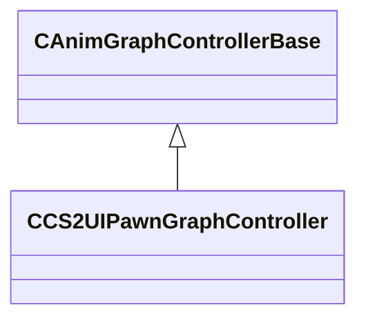

[Schemas](../../schemas.md) / [client](../client.md) / CCS2UIPawnGraphController

# CCS2UIPawnGraphController

**Kind:** class · **Size:** 472 bytes (`0x1d8`) · **Align:** 8 · **Module:** client

**Inherits from:** [CAnimGraphControllerBase](../server/CAnimGraphControllerBase.md)

**Relationships:**

## Memory layout

15 fields (14 declared here, 1 inherited). Offsets are absolute from the object base.

| Offset | Field | Type | From | Annotations |
|--------|-------|------|------|-------------|
| `0x10` | `m_hExternalGraph` | [ExternalAnimGraphHandle_t](../server/ExternalAnimGraphHandle_t.md) | [CAnimGraphControllerBase](../server/CAnimGraphControllerBase.md) |  |
| `0x88` | `m_nAnimationSeed` | CAnimGraph2ParamOptionalRef< float32 > |  |  |
| `0xa0` | `m_characterMode` | CAnimGraph2ParamOptionalRef< CGlobalSymbol > |  |  |
| `0xb8` | `m_bCharacterModeReset` | CAnimGraph2ParamOptionalRef< bool > |  |  |
| `0xd0` | `m_nTeamPreviewVariant` | CAnimGraph2ParamOptionalRef< float32 > |  |  |
| `0xe8` | `m_nTeamPreviewRandom` | CAnimGraph2ParamOptionalRef< float32 > |  |  |
| `0x100` | `m_nTeamPreviewPosition` | CAnimGraph2ParamOptionalRef< float32 > |  |  |
| `0x118` | `m_endOfMatchCelebration` | CAnimGraph2ParamOptionalRef< CGlobalSymbol > |  |  |
| `0x130` | `m_action` | CAnimGraph2ParamOptionalRef< CGlobalSymbol > |  |  |
| `0x148` | `m_bannerAnimation` | CAnimGraph2ParamOptionalRef< CGlobalSymbol > |  |  |
| `0x160` | `m_weaponCategory` | CAnimGraph2ParamOptionalRef< CGlobalSymbol > |  |  |
| `0x178` | `m_weaponType` | CAnimGraph2ParamOptionalRef< CGlobalSymbol > |  |  |
| `0x190` | `m_weaponState` | CAnimGraph2ParamOptionalRef< CGlobalSymbol > |  |  |
| `0x1a8` | `m_inspectTurnAngle` | CAnimGraph2ParamOptionalRef< float32 > |  |  |
| `0x1c0` | `m_bCT` | CAnimGraph2ParamOptionalRef< bool > |  |  |

KV3 class defaults

<pre>{
	&quot;_class&quot;: &quot;CCS2UIPawnGraphController&quot;,
	&quot;m_hExternalGraph&quot;: 4294967295,
	&quot;m_nAnimationSeed&quot;: null,
	&quot;m_characterMode&quot;: null,
	&quot;m_bCharacterModeReset&quot;: null,
	&quot;m_nTeamPreviewVariant&quot;: null,
	&quot;m_nTeamPreviewRandom&quot;: null,
	&quot;m_nTeamPreviewPosition&quot;: null,
	&quot;m_endOfMatchCelebration&quot;: null,
	&quot;m_action&quot;: null,
	&quot;m_bannerAnimation&quot;: null,
	&quot;m_weaponCategory&quot;: null,
	&quot;m_weaponType&quot;: null,
	&quot;m_weaponState&quot;: null,
	&quot;m_inspectTurnAngle&quot;: null,
	&quot;m_bCT&quot;: null
}</pre>

