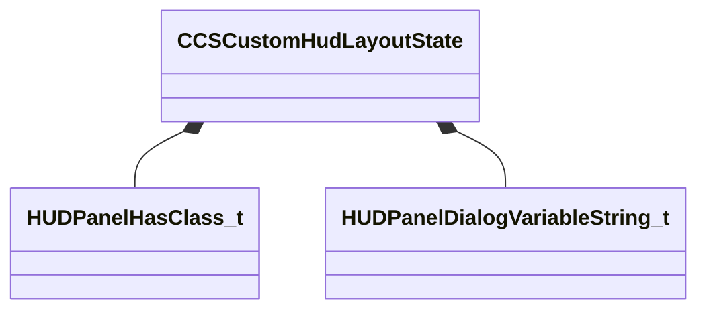

[Schemas](../../schemas.md) / [client](../client.md) / CCSCustomHudLayoutState

# CCSCustomHudLayoutState

> Source: **Build 25000182** · 2026-08-28 · `windows-x86_64` · schema `0.10.0`

**Kind:** class · **Size:** 264 bytes (`0x108`) · **Align:** n/a (unspecified) · **Module:** client

**Twin:** [CCSCustomHudLayoutState (server)](../server/CCSCustomHudLayoutState.md)

**Relationships:**

## Memory layout

4 fields (4 declared here, 0 inherited). Offsets are absolute from the object base.

| Offset | Field | Type | From | Annotations |
|--------|-------|------|------|-------------|
| `0x30` | `m_playerSlot` | CPlayerSlot |  |  |
| `0x34` | `m_bInputCaptureEnabled` | bool |  |  |
| `0x38` | `m_vecHasClasses` | C_NetworkUtlVectorBase< [HUDPanelHasClass_t](../server/HUDPanelHasClass_t.md) > |  |  |
| `0x50` | `m_vecDialogVariableStrings` | C_NetworkUtlVectorBase< [HUDPanelDialogVariableString_t](../server/HUDPanelDialogVariableString_t.md) > |  |  |
