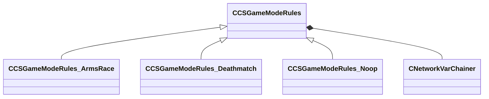

[Schemas](../../schemas.md) / [client](../client.md) / CCSGameModeRules

# CCSGameModeRules

**Kind:** class · **Size:** 48 bytes (`0x30`) · **Align:** 8 · **Module:** client

**Derived by:** [CCSGameModeRules_ArmsRace](../client/CCSGameModeRules_ArmsRace.md), [CCSGameModeRules_Deathmatch](../client/CCSGameModeRules_Deathmatch.md), [CCSGameModeRules_Noop](../client/CCSGameModeRules_Noop.md)

**Relationships:**

## Memory layout

1 fields (1 declared here, 0 inherited). Offsets are absolute from the object base.

| Offset | Field | Type | From | Annotations |
|--------|-------|------|------|-------------|
| `0x8` | `__m_pChainEntity` | [CNetworkVarChainer](../entity2/CNetworkVarChainer.md) |  | `MNotSaved` |
