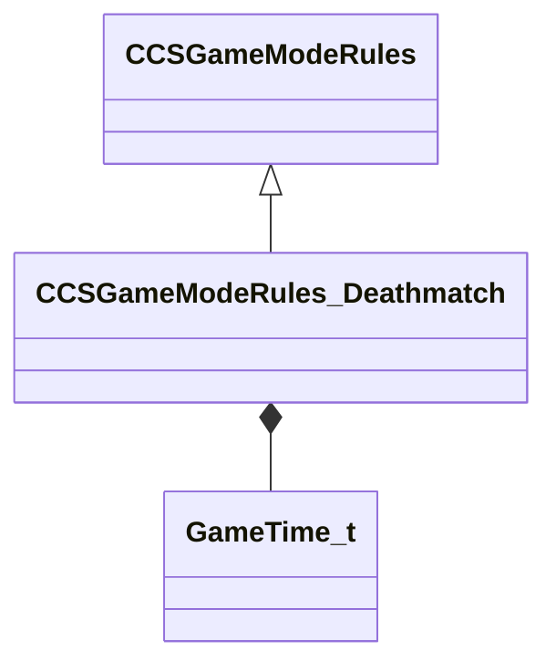

[Schemas](../../schemas.md) / [client](../client.md) / CCSGameModeRules_Deathmatch

# CCSGameModeRules_Deathmatch

**Kind:** class · **Size:** 64 bytes (`0x40`) · **Align:** 8 · **Module:** client

**Inherits from:** [CCSGameModeRules](../client/CCSGameModeRules.md)

**Relationships:**

## Memory layout

4 fields (3 declared here, 1 inherited). Offsets are absolute from the object base.

| Offset | Field | Type | From | Annotations |
|--------|-------|------|------|-------------|
| `0x8` | `__m_pChainEntity` | [CNetworkVarChainer](../entity2/CNetworkVarChainer.md) | [CCSGameModeRules](../client/CCSGameModeRules.md) | `MNotSaved` |
| `0x30` | `m_flDMBonusStartTime` | [GameTime_t](../entity2/GameTime_t.md) |  |  |
| `0x34` | `m_flDMBonusTimeLength` | float32 |  |  |
| `0x38` | `m_sDMBonusWeapon` | CUtlString |  |  |
