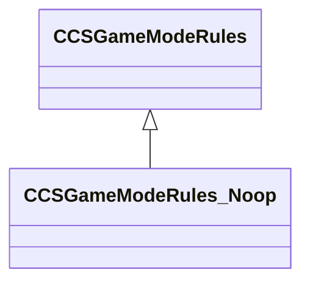

[Schemas](../../schemas.md) / [client](../client.md) / CCSGameModeRules_Noop

# CCSGameModeRules_Noop

**Kind:** class · **Size:** 48 bytes (`0x30`) · **Align:** 8 · **Module:** client

**Inherits from:** [CCSGameModeRules](../client/CCSGameModeRules.md)

**Relationships:**

## Memory layout

1 fields (0 declared here, 1 inherited). Offsets are absolute from the object base.

| Offset | Field | Type | From | Annotations |
|--------|-------|------|------|-------------|
| `0x8` | `__m_pChainEntity` | [CNetworkVarChainer](../entity2/CNetworkVarChainer.md) | [CCSGameModeRules](../client/CCSGameModeRules.md) | `MNotSaved` |
