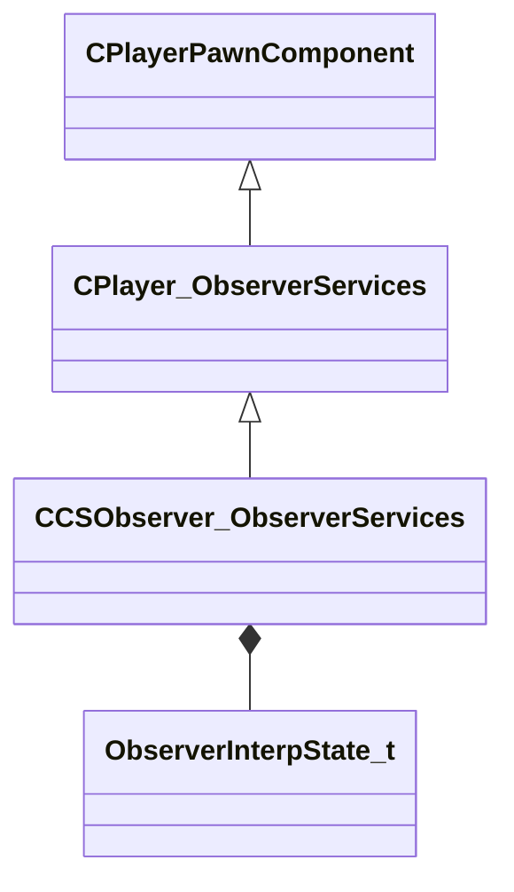

[Schemas](../../schemas.md) / [client](../client.md) / CCSObserver_ObserverServices

# CCSObserver_ObserverServices

> Source: **Build 25000182** · 2026-08-28 · `windows-x86_64` · schema `0.10.0`

**Kind:** class · **Size:** 240 bytes (`0xf0`) · **Align:** n/a (unspecified) · **Module:** client

**Twin:** [CCSObserver_ObserverServices (server)](../server/CCSObserver_ObserverServices.md)

**Inherits from:** [CPlayer_ObserverServices](../client/CPlayer_ObserverServices.md)

**Relationships:**

## Memory layout

9 fields (1 declared here, 8 inherited). Offsets are absolute from the object base.

| Offset | Field | Type | From | Annotations |
|--------|-------|------|------|-------------|
| `0x8` | `__m_pChainEntity` | [CNetworkVarChainer](../entity2/CNetworkVarChainer.md) | [CPlayerPawnComponent](../server/CPlayerPawnComponent.md) | `MNotSaved` |
| `0x30` | `m_pComponentGraphController` | [CAnimGraphControllerPtr](../server/CAnimGraphControllerPtr.md) | [CPlayerPawnComponent](../server/CPlayerPawnComponent.md) |  |
| `0x48` | `m_iObserverMode` | uint8 | [CPlayer_ObserverServices](../client/CPlayer_ObserverServices.md) |  |
| `0x4c` | `m_hObserverTarget` | CHandle< [C_BaseEntity](../client/C_BaseEntity.md) > | [CPlayer_ObserverServices](../client/CPlayer_ObserverServices.md) |  |
| `0x50` | `m_iObserverLastMode` | [ObserverMode_t](../server/ObserverMode_t.md) | [CPlayer_ObserverServices](../client/CPlayer_ObserverServices.md) |  |
| `0x54` | `m_bForcedObserverMode` | bool | [CPlayer_ObserverServices](../client/CPlayer_ObserverServices.md) |  |
| `0x58` | `m_flObserverChaseDistance` | float32 | [CPlayer_ObserverServices](../client/CPlayer_ObserverServices.md) | `MNotSaved` |
| `0x5c` | `m_flObserverChaseDistanceCalcTime` | [GameTime_t](../entity2/GameTime_t.md) | [CPlayer_ObserverServices](../client/CPlayer_ObserverServices.md) | `MNotSaved` |
| `0x68` | `m_obsInterpState` | [ObserverInterpState_t](../server/ObserverInterpState_t.md) |  |  |
